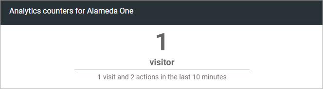
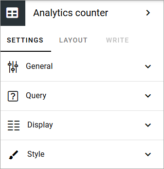
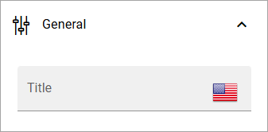
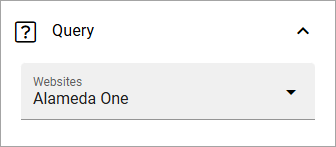
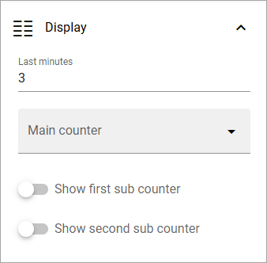
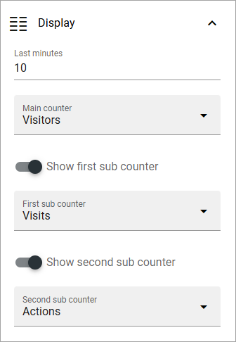
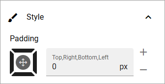

Analytics counter
==================================

This is a new block in Omnia 7.7.

Use it to display simple analytics counters for a chosen website. Here's an example, just after setting up the block up, so not muuch has happened yet.

Settings for the block
*************************

The following settings are available:

General
-----------
As usual for a block, a block title can be added here, in any tenant language.

Query
-----------
Here you select the site to display analytics data for:

Display
------------
The following setteings are available for Display:

+ **Last minutes**: Enter the number of minutes to display analytics for. This will also be shown in the block, see the example above.
+ **Main counter**: Select the main counter: Visits, Visitors or Actions.
+ **Show first/second sub cunter**: You can show the other counters as subcounters. See below for an example.

Here's an example where all three counters will be displayed, Visitors as main counter, Visits as the first sub counter and Actions as the second:

Style
----------
No much here. Just set some padding, if needed:

