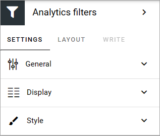
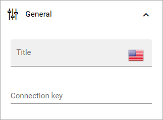
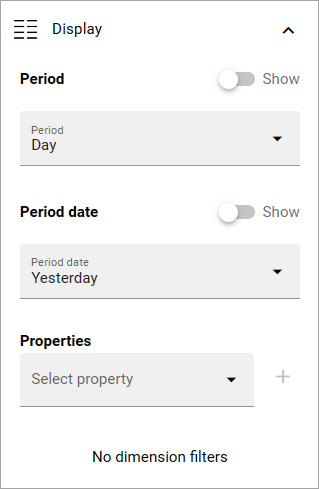
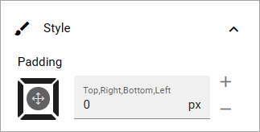

Analytics filters
=============================================

**This description is being edited, due to changes in other analytics blocks. Will be finished soon.**

This is a block for Matomo analytics. Use it to set filters to be used in several Analytics widget blocks. If you're going to use just one widget block, the filter settings can be made there.

Pre requisite: To use Matomo analytics, the tenant feature “Analytics core setup” must be activated, and for a business profile, the feature “Create new analytics website in Matomo” must be activated. It's also important to start collecting analytics data as sooon as possible, as no historic data can be collected. For more information, see: :doc:`Analytics (Matomo) settings </admin-settings/business-group-settings/settings/analytics/index>`

The following settings are available for this block:

General
---------
The following can be set under General:

+ **Connection key**: You can create a connection between this block and several Analytics widget blocks. This is how you can use this filter settings in several widget blocks. Just type a suitable connection key.

Display
---------
The following settings are available here:

+ **Period**: Decide if you want to display period, and if you do, select period in the list.
+ **Period date**: Decide if you want to display period date, and if you do, select period date in the list.
+ **Properties**: Add the properties you want use here. Click the plus for a property you select to add it.
+ **No dimension filters**: If it shouldn't be possible for readers to use dimension filtering to get further details, select this option. 

Style
---------
Here you can set som padding if needed:

Layout and Write
******************
The Write tab is not used here. The Layout tab contains general settings for blocks. For more information see: :doc:`General block settings </blocks/general-block-settings/index>`

