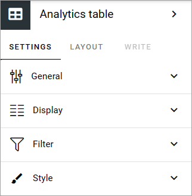
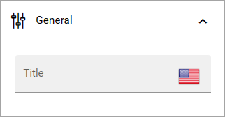
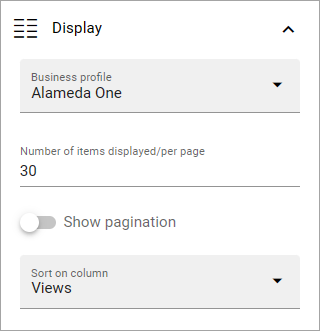
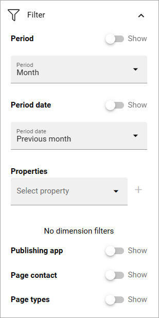
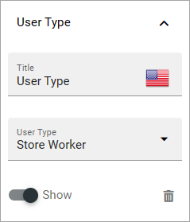
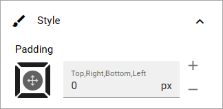

Analytics table block
========================

This is a new block in Omnia 7.6. Here are some basic information. More will be added soon.

The following settings are available for this block:

General
------------
The general settings just contains the optionto add a title for the block:

Display
-------------
Here you decide what to display in the block:

+ **Business profile**: Select business profile to display data from.
+ **Number of items displayed per page**: Add the number of items to display. Important note: If you don't select the option "Show pagination", this is the number of items that will be displayed, regardless if there are more.
+ **Show pagination**: The be able to see additional pages with items, select this option.
+ **Sort on column**: Select the columne to sort the list on. 

Filter
--------
You can decide to display a number of filters the users can use. Select "Show" to activate a filter.

+ **Period**: Period can be week, month or year.
+ **Period date**: Here you set details for the period. Note that you can add custom settings, see this page for more information: :doc:`Custom date filtering </general-assets/custom-date-filtering/index>`
+ **Properties**: This list can be used to add dimension filters the users can filter on. Select one or more properties and then edit the settings. See below for an example.

(The rest of the filters are simply on/off options).

Here's an example of a dimension filter property setting:

Style
------
Not much to it here. You can set some padding if needed.

Layout and Write
******************
The Write tab is not used here. The Layout tab contains general settings for blocks. For more information see: :doc:`General block settings </blocks/general-block-settings/index>`

