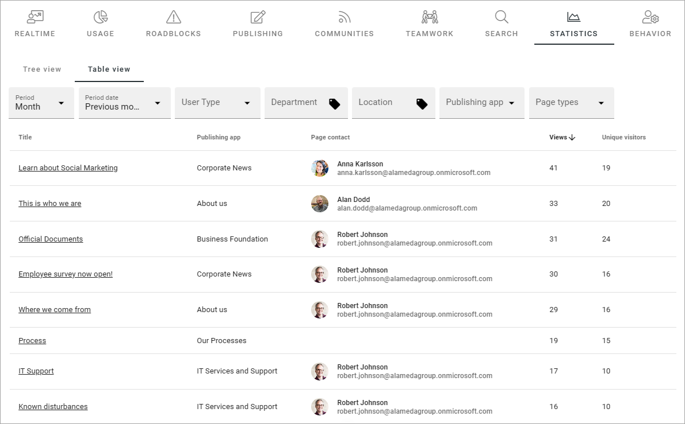

Analytics table
========================

**This page is not valid. This block will be replaced very soon by another and the documentation will be updated.**

This is a new block in Omnia 7.6. Using this block you can display a list of pages in a business profile and see the usage.

Here's an example where the block is used in a governance hub with a lot of filter options:

Note that the block requires a fairly broad space to display all default columns in the list.

Settings
*****************
The following settings are available for this block:

.. image:: analytics-table-settings.png

General
------------
The general settings just contains the option to add a title for the block:

.. image:: analytics-table-settings-general.png

Display
-------------
Here you decide what to display in the block:

.. image:: analytics-table-settings-display.png

+ **Business profile**: Select business profile to display data from.
+ **Number of items displayed per page**: Add the number of items to display on each list page. **Important note**: If you don't select the option "Show pagination", this is the number of items that will be listed, even if there are more.
+ **Show pagination**: To be able to see additional items listed, select this option.
+ **Sort on column**: Select the column to sort the list on. 

Filter
--------
You can decide to display a number of filters. Select "Show" to activate a filter.

.. image:: analytics-table-settings-filter.png

+ **Period**: Period can be week, month or year.
+ **Period date**: Here you set details for the period. Note that you can add custom settings, see this page for more information: :doc:`Custom date filtering </general-assets/custom-date-filtering/index>`
+ **Properties**: This list can be used to add dimension filters the users can filter on. Select one or more properties and then edit the settings. See below for an example.

(The rest of the filters are simply on/off options).

Here's an example of a dimension filter property setting:

.. image:: analytics-table-settings-filter-dimension.png

Style
------
Not much to it here. You can set some padding if needed.

.. image:: analytics-table-settings-style.png

Layout and Write
******************
The Write tab is not used here. The Layout tab contains general settings for blocks. For more information see: :doc:`General block settings </blocks/general-block-settings/index>`

