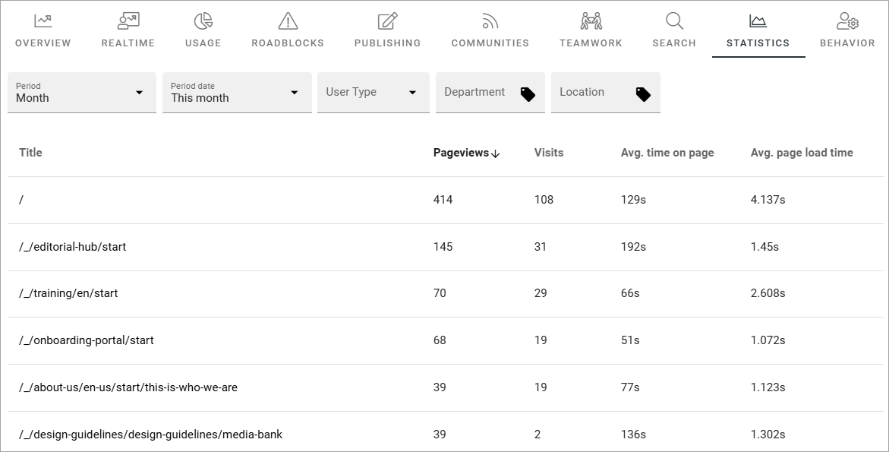
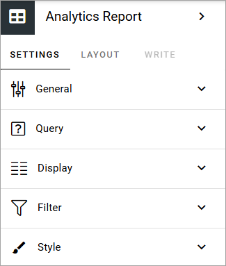
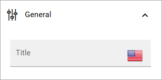
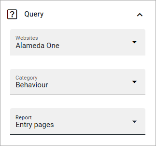
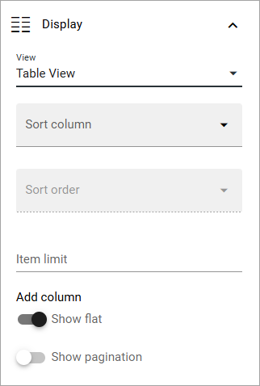
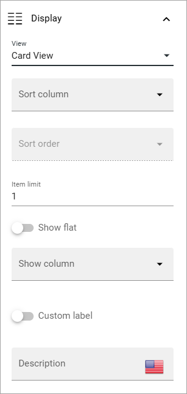
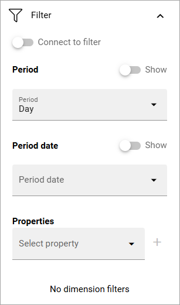
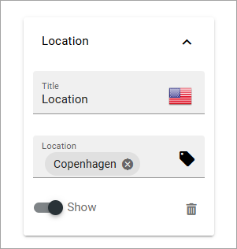

Analytics report
========================

This is a new block in Omnia 7.6. Using this block you can display a list of pages in a business profile and see the usage. The usage data is gathered by Matomo.

Here's an example where the block is used in a governance hub with a lot of filter options:

Note that the block requires a fairly broad space to display all default columns in the list.

Settings
*****************
The following settings are available for this block:

General
------------
Here, you can set a title for the block, if needed:

Query
---------
Here you select web site and category, and when you have selected a category, you can also select a report. Here's an example:

+ **Websites**: Select the website to show analytics data for. In most cases, a "website" is the analytics data for a business profile.
+ **Category**: Select the category to display in the block.
+ **Report**: Select report here. Available reports depend on category chosen.

Display
-------------
Here you choose Table view or Card view. The following settings are available for Table view:

And the folllowing for Card view:

+ **Sort column**: Select the column to sort on.
+ **Sort order**: Select Ascending or Descendin sort order.
+ **Item limit**: If you just want to display a certain number of items, add a number here. For no limit, keep the field empty.
+ **Add column**: For Table view only. You must add at least one column for Table view to work.
+ **Show flat**: Select this option to instruct Matomo API to return data in a flat structure. This is something you normally should do in Omnia. For more information about this Matomo feature, use ChatGPT.
+ **Show pagination**: For Table view only.
+ **Show column**: For Card view only. 
+ **Custom label**: For Card view only. To add a custom label to the cards, select this option and add the label in the field that is shown.
+ **Description**: For Card view only. To add a description the cards, use this field.

Filter
--------
The following filter settings are available for this block:

+ **Connect to filter**: An anlytics report block kan be connected to one or more widget blocks to use the filters set up in the Analytics filter block. If you want to use the filters from an Analytics filter block here, select this option and add the connection key from that block.Then you don't need to set any filter settings in this block. If don't select this option, you can add filter settings for this block, as shown in the image. 
+ **Period**: Period can be day, week, month or year.
+ **Period date**: Here you set details for the period. Note that you can add custom settings, see this page for more information: :doc:`Custom date filtering </general-assets/custom-date-filtering/index>`
+ **Properties**: This list can be used to add dimension filters the users can filter on. Select one or more properties and then edit the settings. See below for an example.

Decide which filters to display, by selecting "Show" to activate a filter.

(The message "No dimension filters" are always shown when no properties/dimension filters has been added).

Here's an example of a dimension filter property setting:

Style
------
Not much to it here. You can set some padding if needed.

.. image:: analytics-table-settings-style.png

Layout and Write
******************
The Write tab is not used here. The Layout tab contains general settings for blocks. For more information see: :doc:`General block settings </blocks/general-block-settings/index>`

