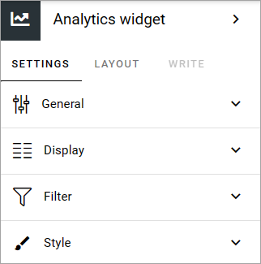
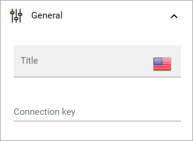
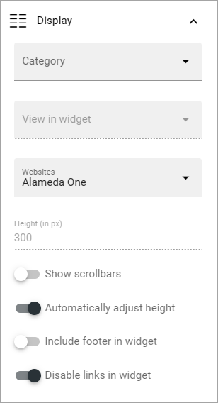
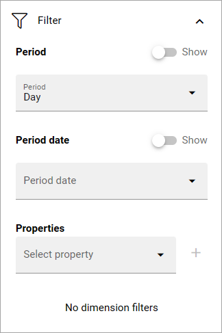
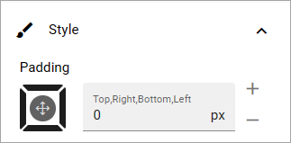

Analytics widget
=============================================

**This block is available in Omnia 7.5. Work on the page is ongoing.**

This block is used to display Matomo analytics data. Several blocks can be used on a page, with different settings, to display different aspects of the analytics data,

The following settings are available for this block:

General
---------
The following can be set under General:

+ **Connection key**: An anlytics filter block kan be connected to one or more widget blocks to use the filters set up in the Analytivs filter block. If you want to use the filters from an Analytics filer block here, add the connection key from that block.

Display
---------
The following settings are available here:

**Note!** A preview is shown in the block so you can easily try out different combinations of settings.

+ **Category**: Select the category to display in the block.
+ **Widget**: Depending on category selected, one or more widgets can ba available. Select the widget you want to use.
+ **View in widget**: For some widgets, different types of views can be available. If there are, this field is shown.
+ **Websites**: (A description will be added soon).
+ **Height (in px)**: You can either set a height for the block in pixels, or choose to automatically adjust the height. If you choose the latter, this option is not available.
+ **Show scrollbars**: Select this option if you want that.
+ **Automatically adjust height**: Select this option if the height of the block should be adjusted automatically.
+ **Include footer in widget**: (A description will be added soon).
+ **Disable links in widget**: (A description will be added soon).

Filter
---------
If you're not using an Analytics filter block for the filters, you can set filters here. These settings are available:

+ **Period**: Decide if you want to display period, and if you do, select period in the list.
+ **Period date**: Decide if you want to display period date, and if you do, select period date in the list.
+ **Properties**: Add the properties you want use here. Click the plus for a property you select to add it.
+ **No dimension filters**: (A description will be added soon). 

Style
---------
Here you can set some padding if needed:

Layout and Write
******************
The Write tab is not used here. The Layout tab contains general settings for blocks. For more information see: :doc:`General block settings </blocks/general-block-settings/index>`

