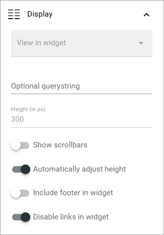
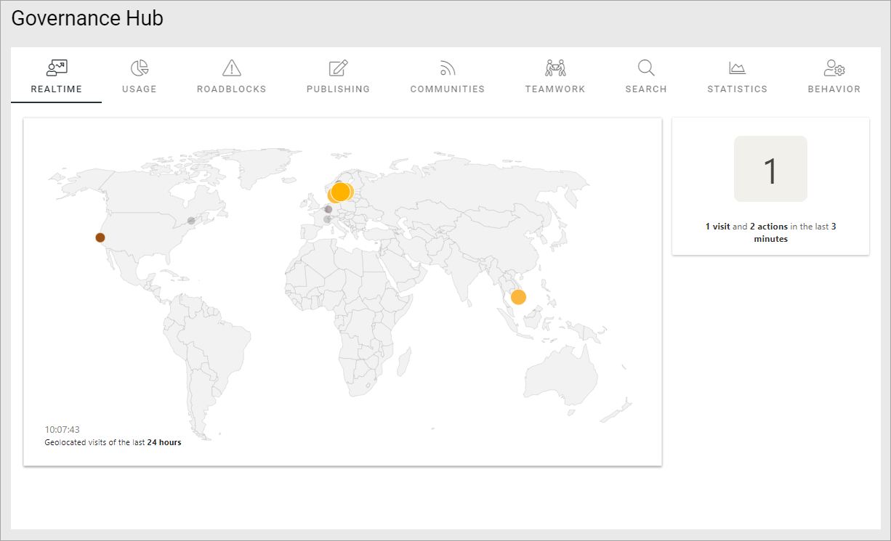

Analytics widget
=============================================

**This description is being edited. Will be finished soon.**

This block is used to display Matomo analytics data. Several blocks can be used on a page, with different settings, to display different aspects of the analytics data.

If you will be using the same filter settings in several widget blocks, it can save some time to set the filter settings in an Analytics filters block and connect the widget blocks to the filters block.

Pre requisite: To use Matomo analytics, the tenant feature “Analytics core setup” must be activated, and for a business profile, the feature “Create new analytics website in Matomo” must be activated. It's also important to start collecting analytics data as sooon as possible, as no historic data can be collected. For more information, see: :doc: `Analytics (Matomo) settings </admin-settings/business-group-settings/settings/analytics/index>`

The following settings are available for this block:

.. image:: analytics-widget-block.png

General
---------
The following can be set under General:

.. image:: analytics-block-widget-general.png

+ **Connection key**: An anlytics filter block kan be connected to one or more widget blocks to use the filters set up in the Analytics filter block. If you want to use the filters from an Analytics filer block here, add the connection key from that block. (And then you don't need to set any filter settings in this block).

Display
---------
The following settings are available here:

**Note!** A preview is shown in the block so you can easily try out different combinations of settings.

+ **Category**: Select the category to display in the block.
+ **Widget**: Depending on category selected, one or more widgets can be available. Select the widget you want to use.
+ **View in widget**: For some widgets, different types of views can be available. If there are, this field is shown.
+ **Websites**: Select the website(s) to show analytics data for. In most cases, a "website" is the analytics data for a business profile.
+ **Height (in px)**: You can either set a height for the block in pixels, or choose to automatically adjust the height. If you choose the latter, this option is not available.
+ **Show scrollbars**: Select this option if you want that.
+ **Automatically adjust height**: Select this option if the height of the block should be adjusted automatically.
+ **Include footer in widget**: For a fotter in the widget block, select this option.
+ **Disable links in widget**: Per default, widget objects can be clicked for more detailed information. If you don't want that, select this option.

Filter
---------
If you're not using an Analytics filter block for the filters, you can set filters here. These settings are available:

.. image:: analytics-block-widget-filter.png

+ **Period**: Decide if you want to display period, and if you do, select the period in the list.
+ **Period date**: Decide if you want to display period date, and if you do, select period date in the list.
+ **Properties**: Add the properties you want use here. Click the plus for a property you select to add it.
+ **No dimension filters**: Dimensions are set up in the Matomo settings (business profile level). If they should not be used in this block, select this option. 

Style
---------
Here you can set some padding if needed:

.. image:: analytics-block-widget-style.png

Layout and Write
******************
The Write tab is not used here. The Layout tab contains general settings for blocks. For more information see: :doc:`General block settings </blocks/general-block-settings/index>`

An implementation example
****************************
Here's an example of a number of Anlytics widget blocks to display analytics data in different ways:

