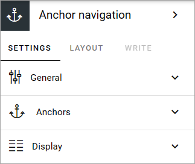
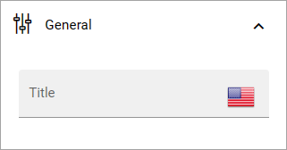
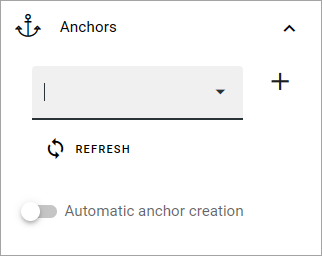
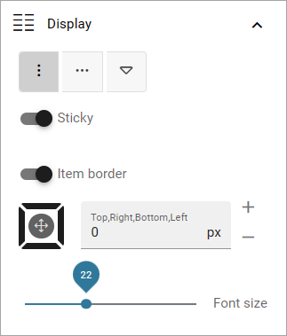

Anchor navigation
=============================================

**This block is available in Omnia 7.5. Work on the page has just started.**

Use this block for navigation through anchors.

The following settings are available:

General
--------
Set a title for the block here, if needed.

Anchors
--------
Here you decide which anchors to use in the navigation.

(Descriptions will be added soon).

Display
--------
Here you can edit some settings for the display of the navigation.

(Descriptions will be added soon).

Layout and Write
******************
The Write tab is not used here. The Layout tab contains general settings for blocks. For more information see: :doc:`General block settings </blocks/general-block-settings/index>`
