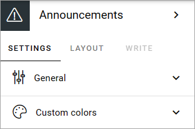
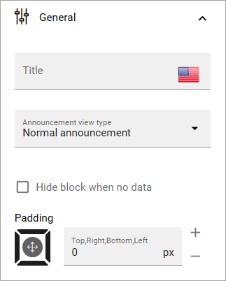
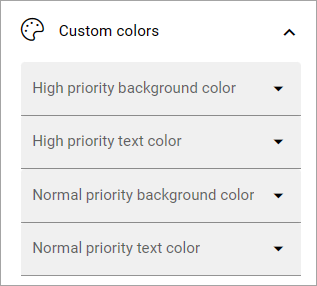

Announcements
===========================================

Announcements are created by administrators and will display important information in the whole tenant, or for a certain business profile. The Priority (status) of an announcement can be Normal or High. Announcements can be displayed at the top or in a block, which is what's described here.

An announcement displayed in a block can look like this for the user:

.. image:: announcement-user.png

Settings for the block
***********************
The following settings are available for the Announcements block:

General
----------------
Here you can set the following:

+ **Title**: If a title should be shown for the block, add it in this field. If no variation exists for the page, it looks like in the image above and you can set the title in the languages active in the tenant. If variations exists, only one title can be set. In that case, titles in other languages are set in the variations.
+ **Announcement view type**: You can choose to display all announcements (meaning both normal and high priority) or high priority announcements only. (Options has deen changed, image will be replaced soon).
+ **Hide block when no data**: As it says, select this to not show the block when there are no announcements to show for the logged in user.
+ **Padding**: Use this option to set some padding for the text within the block.

Custom colors
----------------------
Colors should be set centrally for consistency, but if needed, the following custom colors can be set here:

Layout and Write
*********************
The WRITE TAB is not used here. The LAYOUT tab contains general settings, see: :doc:`General Block Settings </blocks/general-block-settings/index>`

