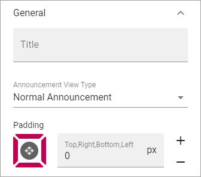

Announcements
===========================================

Announcements are created by administrators and will display important information in the whole tenant, or for a certain business profile. The Priority (status) of an announcement can be Normal or High. Announcements can be displayed at the top or in a block, which is what's described here.

The end user experience
***********************
An announcement displayed in a block can look like this:

.. image:: announcement-user.png

Settings for the block
***********************
The following settings are available for the Announcements block:

.. image:: announcements-settings-new.png

The Layout tab options are general block settings, see this page for information: :doc:`General Block Settings </blocks/general-block-settings/index>`

General
----------------
Here you can set the following:

+ **Title**: Set a title to be displayed in the block.
+ **Announcement View Type**: Select to display Normal Announcements or High Priority Announcements.
+ **Padding**: Use this option to set some padding for the text within the block.

Custom Colors
----------------------
Colors should be set centrally for consistency, but if needed, the following custom colors can be set here:

.. image:: announcements-settings-general-colors-new.png

Layout and Advanced
**********************
The tabs Layout and Advanced contain general settings, see: :doc:`General Block Settings </blocks/general-block-settings/index>`

