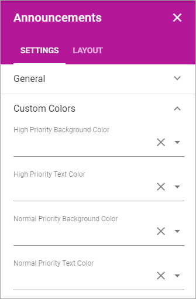

Announcements
===========================================

Announcements are created by administrators and will display important information in the whole tenant, or for a certain business profile. The Priority (status) of an announcement can be Normal or High. Announcements can be displayed at the top, in the Notification panel, or in a block, which is what's described here.

The end user experience
***********************
An announcement displayed in a block can look like this:

.. image:: announcement-user.png

Commenting Announcements (will this work????)
-------------------------------------
If commenting is allowed for the Announcement (set indivually for each Announcement) any user can comment the announcement. It works the same way as commenting a publishing page, for example news. The number of comments for each message are shown in the list, for example:

.. image:: announcement-commented.png

To read or add comments, click "Comment(s)" and something like the following is shown:

.. image:: announcement-commented-read-new.png

Settings for the block
***********************
The following settings are available for the Announcements block:

.. image:: announcements-settings.png

Note that the Layout tab is general for all blocks. It's described here: (A link will be added)

General
----------------
Here you can set the following:

.. image:: announcements-settings-general.png

+ **Title**: Set a title to be displayed in the block.
+ **Announcement View Type**: Select to display Normal Announcements or High Priority Announcements.
+ **Padding**: Use this option to set some padding for the text within the block.

Custom Colors
----------------------
Colors should be set centrally for consistency, but if needed, the following custom colors can be set here:

