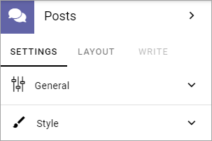
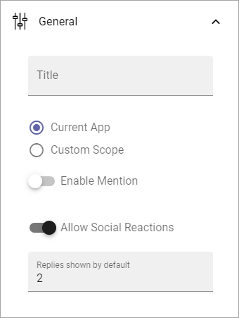
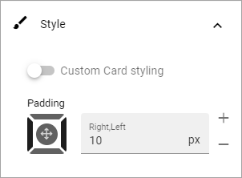
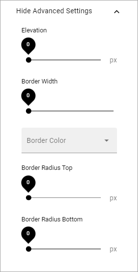

Posts block
=====================================

This block makes it possible to post conversation messages in an app. It can be used to implement a discussion within a community or a conversation within a teamwork.

It's also possible to aggregated messages from several sources and to post a message to a specific community, publishing app or teamwork app.

**Important Note**: To be able to post message in this block, a user must be added to or belong to a group added to the App Contributors field for the app (found under Security in the app settings).

The following settings are available:

General
**********
These settings are available under General (image from Omnia 6.12):

+ **Title**: Add a block title if needed.
+ **Current App**: If the scope should be this app only, select this option.
+ **Custom Scope**: To set a different scope, select this option. See below for more information.
+ **Enable Mention**: If mentions should be possible in the posts, this option must be selected. Default=off.
+ **Allow social reactions**: Can be available in Omnia 6.12. If it should be possible to to use social reactions in this block, select this option. The same social reactions functionality as in Teams can be used. The corresponding tenant feature must be activated for this option to be available.
+ **Allow Likes**: If it should be able to like a comment, select this option. If the tenant feature "Social reactions" is activated, the "Allow social reactions" option replaces this option. Then social reactions is used instead of likes.
+ **Replies shown by default**: Decide the number of replies the should be shown for each post, before a Show more link is shown. Default=2. 

General note about Scope: Use Scope to set up which sources to get messages from, to show in this block.

Custom Scope
---------------
For Custom Scope you can select Communities, Publishing Apps or Teamwork Apps. When this is done, select one or more in the next list. Messages from all selected communities or apps will then be shown in the block (but also see "Filter by followed" below).

These two options are also available:

.. image:: posts-block-general-custom.png

+ **Filter by followed**: If only messages from the communities or apps the logged in user follows should be shown, select this option.
+ **Enable Organization-wide posts**: In this context "Organization-wide" means the whole Business Profile. Decide if it should be possible to post a message to another communitiy, publishing app or teamwork app in the Business Profile. You must see too that there is a receiving block somewhere for this option to actually do anything.

Style
********
This is available under Style:

If you want to use the general block style settings for the Business Profile, you don't have to do anything, besides setting some padding if nedded.

If you would like to use custom style settings for this block, this is available:

.. image:: posts-block-custom.png

By clicking on the icon you can select theme for the block.

Under "Advanced Settings" you can find the following:

Layout and Write
*********************
The WRITE Tab is not used here. The LAYOUT tab contains general settings, see: :doc:`General Block Settings </blocks/general-block-settings/index>`
