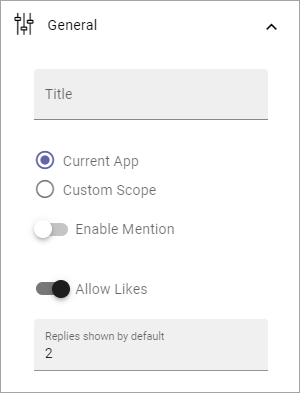

Posts block
=====================================

This block makes it possible to post conversation messages in an app. It can be used to implement a discussion within a community or a conversation within a teamwork.

The block is available in Omnia 6.10 and later.

The following settings are available:

.. image:: posts-block-all.png

General
**********
These settings are available under General:

+ **Title**: Add a block title if needed.
+ **Current App**: If the scope should be this app only, select this option.
+ **Custom Scope**: To set a different scope, select this option. See below for more information.
+ **Enable Mention**: If mentions should be possible in the posts, this option must be selected. Default=off.
+ **Allow Likes**: Likes is on by default. if it should not be available, deselect this option.
+ **Replies shown by default**: Decide the number of replies the should be shown for each post, before a Show more link is shown. Default=2. 

Custom scope
---------------
For Custom scope you can select Communities, Publishing Apps or Teamwork Apps. When this is done, select one or more in the next list.

These two options are also available:

.. image:: posts-block-general-custom.png

(Information about these options will be added soon).

Style
********
This is available under Style:

.. image:: posts-block-style.png

If you want to use the general block style settings for the Business Profile, you don't have to do anything, besides setting some padding if nedded.

If you would like to use custom style settings for this block, this is available:

.. image:: posts-block-custom.png

By clicking on the icon you can select theme for the block.

Under "Advanced Settings" you can find the following:

.. image:: posts-block-advanced.png

Layout and Write
*********************
The WRITE Tab is not used here. The LAYOUT tab contains general settings, see: :doc:`General Block Settings </blocks/general-block-settings/index>`
