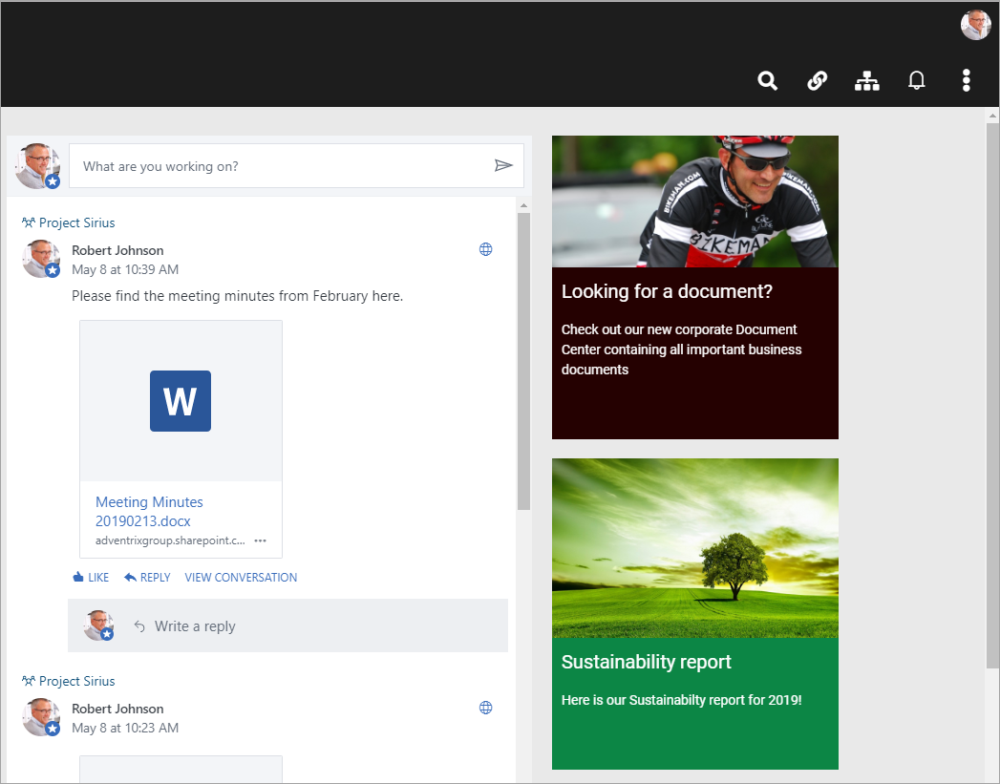
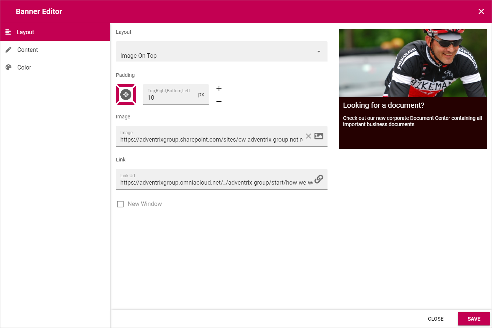
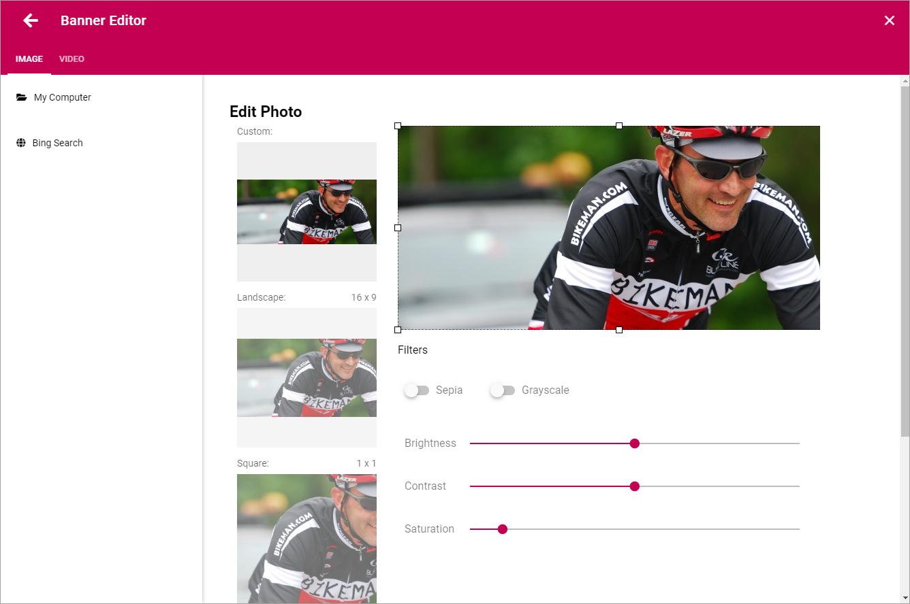
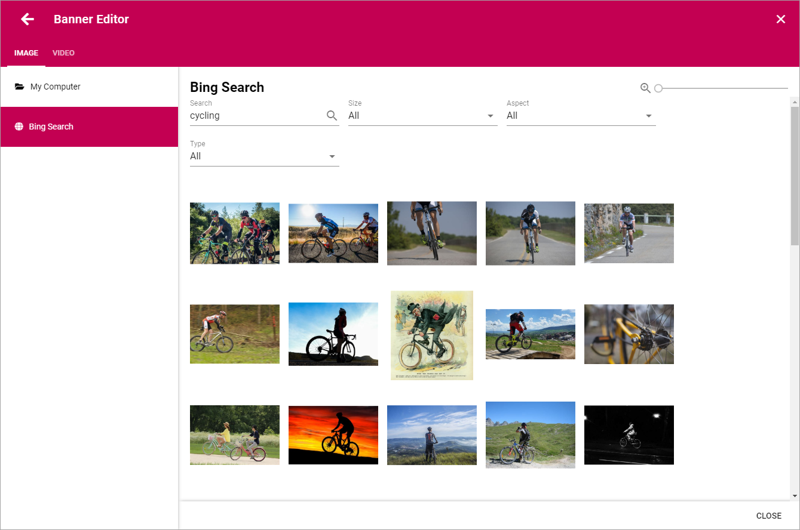
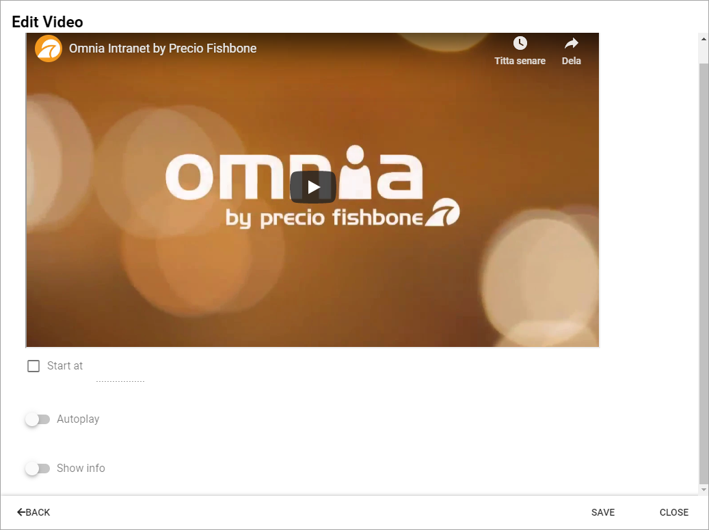
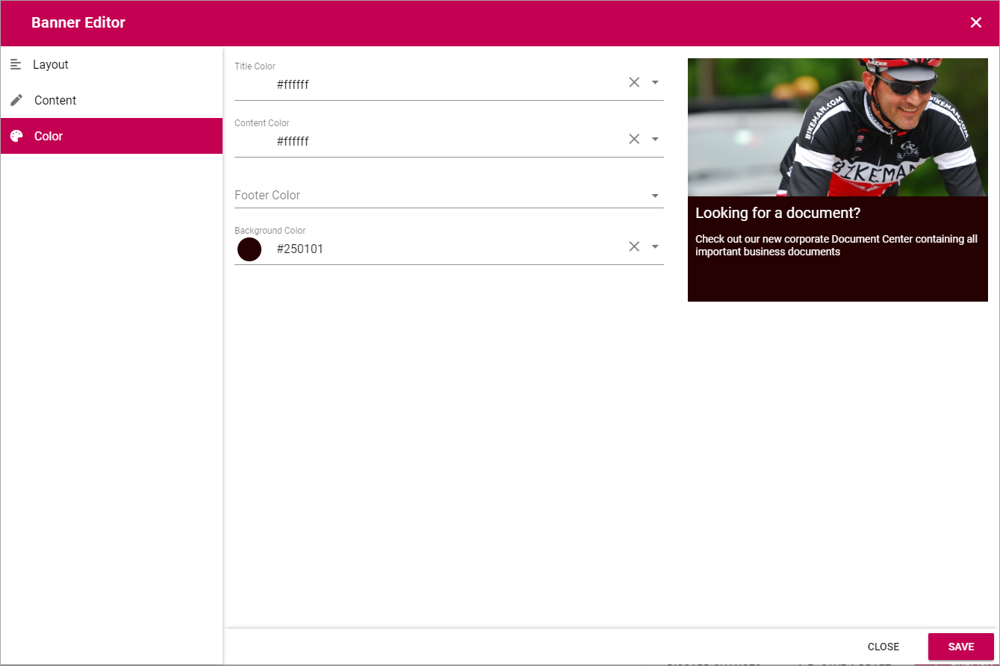

Banner
===========================================

Through the Banner block a web editor can add banners on a web page.

You use the Banner Editor to edit the banner. You do it the same way for existing and newly added banners.

Using the Banner Editor
************************
To edit a banner, edit the page in Design mode and click this icon:

.. image:: edit-banner.png

The Banner Editor starts and the contents of the banner, if any, is loaded. As you edit the banner you can see a preview to the right.

The Layout tab
---------------
Here you can work with the following:

+ **Layout**: Defines the Layout of the banner:
  + *Image On Top*: Displays a big image at the top, above title, content and footer. Best suitable for landscape images.
  + *Title and Content on image*: The image covers the whole banner area, title and content are placed as an overlay.
  + *Title on image*: A variant of the above, in this case only the title is placed as an overlay.
+ **Padding**: You can set some padding for the text in the banner here.
+ **Image**: Use this field to add an image or a video. When you click the icon to the right, the Image/Video options are displayed, see below.
+ **Link**: Add the link to open, if any, when the user clicks the banner. When you click the icon to the right, the Custom Link options are displayed, see below.
+ **New Window**: Defines whether the link should be opened in a new window or not.

The Image/Video options
-----------------------
The following options are available for the banner image/video:

You can select a photo from your computer or do a Bing search. When using the Bing Search you simply type a search word and can then refine your search.

When you have selected an image, you can customize which part of the image to show, by using the squares and drag the borders of the image. You can also use the filters "Sepia" and "Grayscale" for image effects. Besides that you can edit the image by using the sliders "Brightness", "Contrast" and "Saturation".

You can add a video for the banner, instead of an image, either from your company's local Steam area, or from YouTube. Find the url for the video, copy it and paste in the field.

.. image:: banner-video.png

When you have selected a video, you can set the following:

You can set where in the video it should start playing, if it will start automatically (Autoplay) and if information about the video should be shown.

The Content tab
----------------
Here you can add a title, a text and a footer, if needed. For the text you can do some basic formatting.

.. image:: banner-content.png

When adding content, the preview to the right is very useful to see how the banner will look.

The Color tab
--------------
Here you can set the color for title, content, footer and background.

