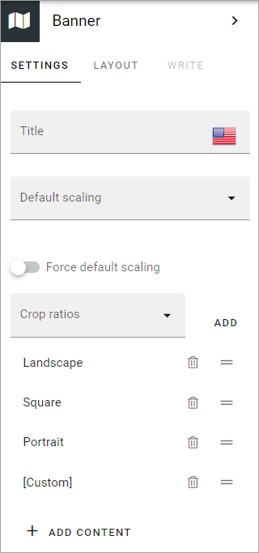
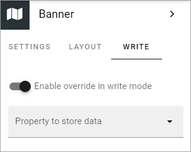
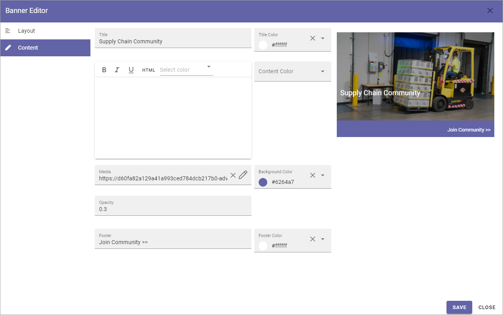

Banner
===========================================

Using the Banner block an editor can add banners to a publishing page.

.. image:: banners-new.png

You add a Banner block the same way as any other block, see :doc:`Working with blocks </blocks/working-with-blocks/index>` 

Editing an existing banner
****************************
Depending on settings, it can be allowed to edit a banner in edit mode. When it is, a banner can be edited by clicking the pen icon:

.. image:: banner-pen-icon.png

The banner editor opens and you can use the same settings as when adding content to a new banner, see below.

Banner settings
****************
The following banner settings are available (also see *The Banner editor*, below):

Settings
---------
Here's what is available on the Settings tab:

+ **Title**: If a title should be shown for the block, add it in this field.
+ **Default scaling**: You can select a default scaling for the image used in the banner, but this can be changed by an author (Write mode). Possible scalings are set up in Omnia Admin.
+ **Force sefault scaling**: Select this option to make sure the image in the banner always is scaled using the default scaling set above. If you do, scaling can not be edited using Write mode.
+ **Crop ratios**: Use this list to set up which crop ratios editors should be able to choose from when editing in Write mode, for the image in this block. For more information, see below.
+ **ADD CONTENT**: Click here to add default content to the block. Also see below.

Set crop ratios
---------------------
Available crop ratios are set up in Omnia admin. Here you can set which of these should be available to choose from in this block.

.. image:: banner-block-crop-ratios.png

To add a crop ratio, open the list and click ADD. To delete a crop ratio, click the dust bin.

Besides that, you can set the order, by grabbing this icon and use drag and drop:

.. image:: banner-block-crop-ratios-order.png

Add default content
---------------------
When you click ADD CONTENT the banner editor starts and you use it to add default content the same way as is described below under *The banner editor*.

You can use the WRITE tab to set if editors should be able to edit the default content in Write mode or not, see below.

Layout
**********
The LAYOUT tab contains general settings, see: :doc:`General block settings </blocks/general-block-settings/index>`

Write
******
Using the WRITE tab you can set the following:

+ **Enable overwrite in Write mode**: If it should be possible for editors to edit the default content in the block, this option should be on. If not, click to set it to off.
+ **Property to store data**: Select type of property to connect the Banner to. When one block on the page has data connected to a property, that data can be reused in all blocks that uses the same Property. Page scoped. Not mandatory.

Adding content to a new banner
*******************************
You add content to a new banner this way in Write mode:

1. click "ADD CONTENT".

If editing is allowed, the banner editor starts and you use it to add the contents, see below.

The banner editor
******************
You use the banner editor to edit the banner's contents. You do it the same way for existing and newly added banners. As you edit the banner you can see a preview to the right. However, default content in the banner may be locked (settings on the WRITE tab, see above), and can therefore not be edited.

.. image:: banner-editor-layout-new3.png

The Layout tab
---------------
Here you can edit the following:

+ **Layout**: Defines the Layout of the banner:
    - "Image on top"; Displays a big image at the top, above title, content and footer, best suitable for landscape image.
    - "Title and content on image"; The image covers the whole banner area, title and content are placed as an overlay. 
    - "Title on image"; In this case only the title is placed as an overlay.
+ **Padding**: You can set some padding for the text in the banner here.
+ **Link**: Add link to open, if any, when the user clicks the banner. When you click the icon to the right in the field, a new tab is shown; Custom link. It works the same way as the Add link general asset, see: :doc:`Add link </general-assets/add-link/index>`
+ **New window**: Defines whether the link should be opened in a new window or not.

The Content tab
----------------
Here you can add a title, an image, a text and a footer, and set colors.

Regarding the content - the formatting options can vary depending on settings for Limited RTF done in Omnia Admin, see: :doc:`RTF editor settings </admin-settings/tenant-settings/settings/rtf-editor/index>`

When you click the icon to add an image, the media picker starts, see this page for more information: :doc:`The media picker </general-assets/media-picker/media-picker-v6/index>`

Don't forget to save when you're done.

