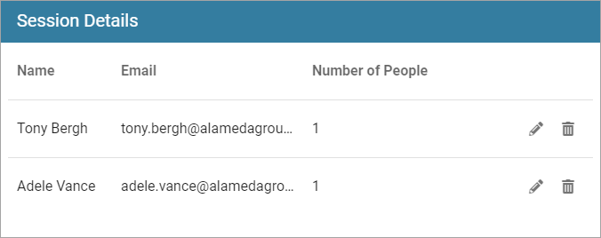
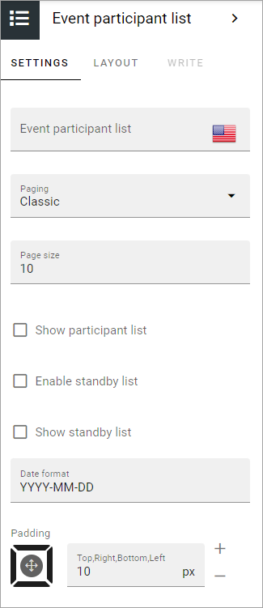

Events participant list
==========================

Use this block to list participants that has registered for an event.

Here's how it can look for a user:

The user can edit or remove his or her registrations (and so can Event Administrators).

Settings
*********
The following settings are available for the block:

+ **Event participant list**: Here you can add a title for the block. If variations exists, you add a title in the default language. All other languages are handled by variations. If no variations exists, you can add a title in several languages here.
+ **Paging**: Select paging for the lists here; No paging, Classic or Scroll.
+ **Page size**: Set the number of rows to display. Important Note: If more participants are available than the Page Size set, a navigation to the next page is shown when Paging is set to “Classic”. If Paging is set to either “No paging” or “Scroll”, Page Size is the maximum number of participants that can be shown in the lists, regardless of how many there are available.
+ **Show participant list**: Event Administrators can always see the participants listed here. If the list should be visible for all users, select this option.
+ **Enable standby list**: If it should be possible to register even when all the available registrations are taken, select this option. Additional registrations are then added to a Standby list (Reservation list).
+ **Show standby list**: Event administrators can always see the participants listed in the standby list (Reservation list). If the list should be visible for all users, select this option.
+ **Date format**: Add a date format here, if needed. Default=YYY-MM-DD.
+ **Padding**: If some padding is needed between the block edges and the lists, add it here.

Layout and Write
*********************
The WRITE TAB is not used here. The LAYOUT tab contains general settings, see: :doc:`General Block Settings </blocks/general-block-settings/index>`

