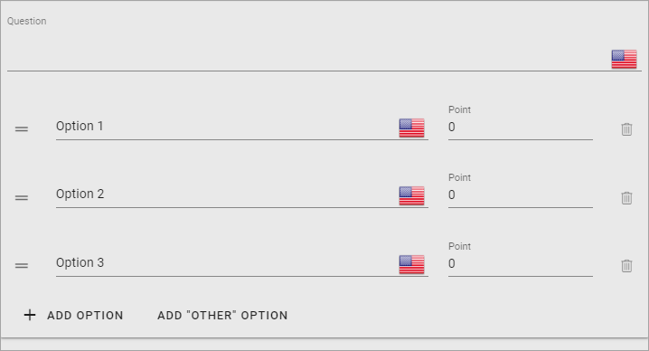
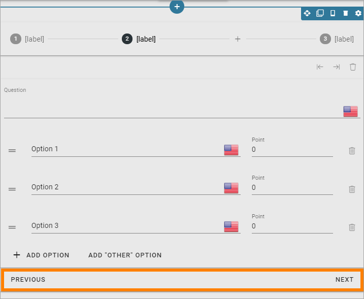
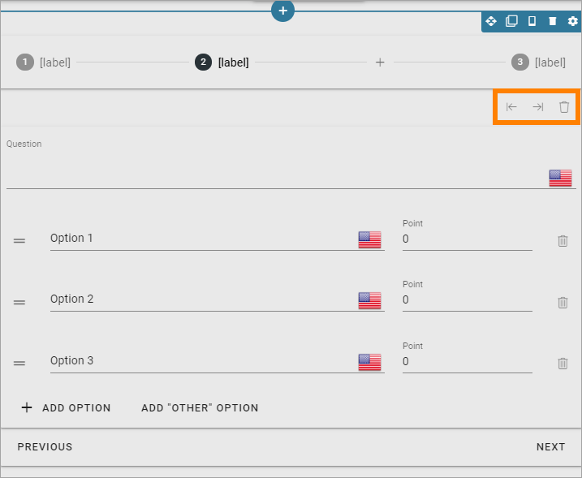

Form question
================

The block is used only when working with the graphic presentation of a form, in Omnia admin. The block can not be used on a normal page.

Here's an example of a Form question block added to a Survey:

Editing the block
******************
This is what you can do in the block, for each step (page):

1. Add the question at the top.
2. Add as many options as you need. 

Question and options can be be added in any or all the available tenant languages.

3. Add the number of points for each option (points can be turned off in the settings for the form).
4. If you need more options for the question, click ADD OPTION.
5. If you need fewer options, click the dust bin for the options you don't need.
6. To change the order, grab the icon to the left and drag to the desired position.

To add a new step (page), click the plus here:

.. image:: form-question-add-step.png

When you have added additional steps, it's shown here:

.. image:: form-question-add-step-2.png

This is the stepper section, new in v6.5.

You can navigate between steps by using the links at the bottom:

By using these icons, you can move a step or remove a step:

To set labels for the steps, use the settings for the stepper section:

.. image:: form-question-add-step-label.png

