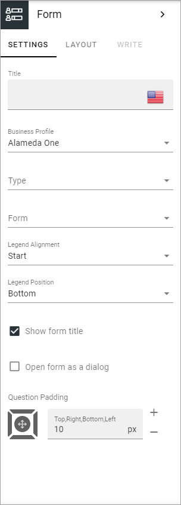

Form block
============

Use this block to make a form available for users. 

A form can be a survey, a poll or a checkup. These forms are created and maintained in Omnia admin. See this page for more information: :doc:`Forms </admin-settings/business-group-settings/forms/index>`

Here's an example with a poll that the user already has submitted to, and only the result is available:

.. image:: poll-example.png

Settings
**********
The following settings are available for this block:

+ **Title**: Add a title for the block, if needed. Can be added in any or all the available tenant languages.
+ **Business profile**: Select the business profile where the form is created.
+ **Type**: Select the type: Polls, Checkups or Surveys.
+ **Form**: Select the form to display in the block.
+ **Legend alignment**: Select the alignment of the description in the diagrams here. Works together with the Legend position. In the example at the top of this page, the legend alignment is "Start".
+ **Legend position**: Select position for the description in the diagrams, in relation to the Legend alignment. In the example at the top of this page, the legend position is "Bottom".
+ **Show form title**: When the form was created, a title is added. If you want to show that title here, select this option.
+ **Open form as a dialog**: To open the form as a dialog, not as a page, select this option.
+ **Question padding**: If needed, add som padding.

Layout and Write
******************
The Write tab is not used here. The LAYOUT tab contains general settings, see: :doc:`General Block Settings </blocks/general-block-settings/index>`

