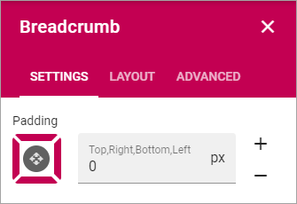

Breadcrumb
===========================================

The breadcrumb block makes it possible for end user to navigate to any parent node of the current page in the navigation structure.

For physical pages, that is not part of the navigation structure (for example news articles), it will show the welcome page of the current publishing sites as the parent node.

.. image:: breadcrumb.png

Settings for the block
************************
The only setting available for the Breadcrumb block is padding.

Layout and Advanced
**********************
The tabs Layout and Advanced contain general settings, see: :doc:`General Block Settings </blocks/general-block-settings/index>`
