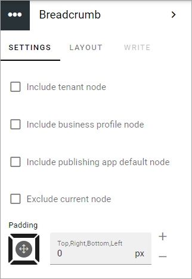

Breadcrumb
===========================================

The breadcrumb block makes it possible for end user to navigate to any parent node of the current page in the navigation structure.

For physical pages, that is not part of the navigation structure (for example news articles), it will show the welcome page of the current publishing sites as the parent node.

.. image:: breadcrumb-new.png

Settings for the block
************************
The following settings are available for the Breadcrumb block:

+ **Include tenant node**: Select this option to always display the tenant Node. The text for this is set in Omnia admin, in the Title field under Tenant-Settings-General.
+ **Include business profile node**: Select this option to always display the business profile node. The text for this is the name for the business profile as set in Omnia admin, Tenant-Business profiles.
+ **Include publishing spp default node**: This is especially useful if there are several page collections in a publishing app, and you want to show that they belong together. The title of the publishing app is set when it's created and can later be edited in OmniaaAdmin under Publishing for the business profile.
+ **Exclude current node**: To not show the current node in the breadcrum, select this option.

For more information about the tenant title, see: :doc:`Settings (Tenant) </admin-settings/tenant-settings/settings/index>`

For more information about the business profile title, see: :doc:`Business profiles </admin-settings/tenant-settings/business-profiles/index>`

For more information about how to change a publishing app's title, see: :doc:`Publishing </admin-settings/business-group-settings/publishing-apps/index>`

Layout and Write
*********************
The WRITE TAB is not used here. The LAYOUT tab contains general settings, see: :doc:`General Block Settings </blocks/general-block-settings/index>`
