Action button
=========================================

Use this block to add one or more actions activated by buttons on a page.

All actions that can be added to an Action Menu can also be added as an action button. Now you can create access to these actions the way that suits your organization.

The following actions are available to add as a button:

+ Add as favourite
+ Add to My calendar
+ Create app
+ Create aocument
+ Create page
+ Event management
+ Export process
+ Invite co-authors
+ Like
+ Link
+ My links
+ My subscriptions
+ Notification panel
+ Omnia admin
+ Page feedback
+ Process feedback
+ Quick search
+ Share
+ Sign-off requests
+ Strenghten profile
+ Subscribe
+ Teamwork navigation
+ Tutorial

Settings
***********
The following settings are available:

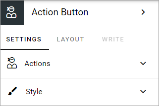

Add an action button
***********************
Note that you can see a preview of the button/buttons in the block as you're working on it.

To add an action button in this block, do the following:

1. Open Actions.
2. Click ADD BUTTON.
3. Use the settings. Here's an example:

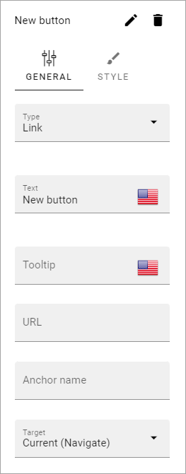

General
**********
Available settings differ depending on type of button chosen. The following settings are available for all types:

+ **Type**: Select type of button here. 
+ **Text**: Add text to be shown on the button, in any tenant language.
+ **Tool tip**: Add the tool tip text for the button here. 

Add as favourite
------------------
The purpose of this action is for the logged in user to add a favourites link for a page:

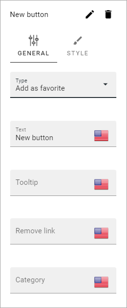

+ **Remove link**: When a favourites link has been added, the text on the button changes so the user can remove the page from the favourites list. Add that text here. 
+ **Category**: If the Favourite link should be added to a specific category, type the name of the category here. It can be a new or an existing category.

Add to My calendar
--------------------
Can be placed on any Omnia page. When a user clicks the button, an ics file for the page is created and downloaded to the users Download folder. The ics file can then be added to the user's calendar. For use with events, or for som other use.

Settings specific for the button, which all are related to events, are the following:

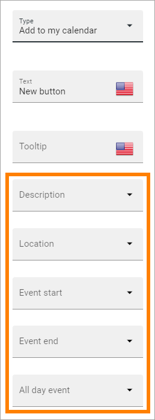

Select property to be used for a description and information on location, event start and end or for an all day event.

Create app
------------
The purpose of this action is to make it possilble for users to create an Omnia app, just like the Create app block.

The following settings are available for this purpose (se above for the general ones):

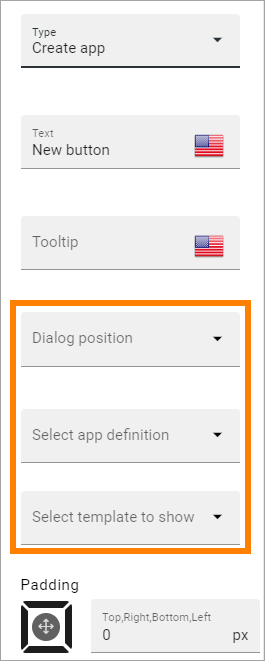

+ **Dialog position**: Select position for the dialog that will open; Center or Right.
+ **Select app definition**: Publishing, Community or Teamwork.
+ **Select template to show**: When you have selected app definition, here you select the template(s) that should be available. A list of all available templates for the definition is shown. You select one or more templates there.

Create document
----------------
The purpose of this action is to make it possible to create a document. When the button is clicked, the Create new document wizard starts. See this page for more information:

:doc:`Using the Create new document wizard </working-with-documents/using-the-document-wizard/index>`

(Only general settings are available, see above).

Create page
-------------
Using this button the action Create page can be executed:

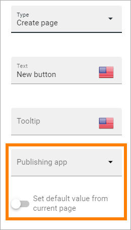

+ **Publishing app**: Select publishing app to create the new page in.
+ **Set default value from current page**: When you select theis option, also choose property in the field shown. When this is selected, the new page gets the value for this property from the current page.

Event management
------------------
Using this type you can add buttons for Event management actions:

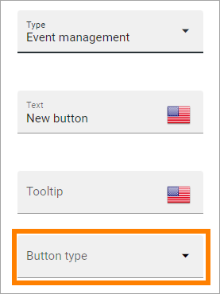

+ **Button type**: Decide what this button will do; Sign up, Sign up other, Add to Outlook or Cancel:

+ Sign up: Used by the logged in user to register for an event. 
+ Sign up other: Used by the logged in user to register others - colleagues or external partners - for an event.
+ Add to Outlook: In the case event management is set up to use a specific calendar, this button can be added to make it possible for users to add the event to their personal calendar.
+ Cancel: Used by the logged in user to cancel the registration he or she has made in their own name, ie done by using the button "Sign up".
+ Open Microsoft Teams meeting: If a Teams Meeting was created when the event was created, this button can be used to open that meeting. If no meeting has been created this option has no effect.

For more information about how the buttons work and more useful tips for event management, see: :doc:`Working with events </working-with-events/index>`

Export process
----------------
This button can be used to print a process. Must be used on a process page to work. See this page for more information: :doc:`Print a process </working-with-processes/print-process/index>`

Invite co-authors
-------------------
This action is available for authors in the action menu, when editing a page. It can also be added as an action button.

For more information, see: :doc:`Invite co-authors </pages/invite-co-authors/index>`

(Only general settings are available, see above).

Like
-------
Page likes and comments can be added as a block on a page, but the Like action can also be added as an action button:

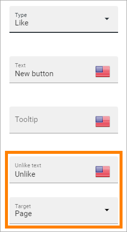

+ **Unlike text**: When a user has liked a page, the text on the button changes to "Unlike". If you want some other unlike-text, edit the text here.
+ **Target**: Target can only be Page for now and is selected by default.

Link
------
Using this action a link action can be added, meaning a link can be opened:

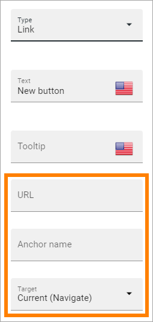

+ **URL**: Type or paste the URL to go to when a user clicks the link. 
+ **Anchor name**: Type the anchor name in this field to create a link to an anchor.
+ **Target**: Choose how to open the link. Current (Navigate) means the same window. Current (Open) is used for pages with anonymous access. 
+ **Dialog position**: If you selected "Dialog" for target, you can select where to place the dialog: Center, Full screen, Left or Right. 

**Note!** Dialog is not suitable for external links. Select "Current Window" or " New Window" for external links.

For more information about how to work with, and link to anchors, see: :doc:`Using anchors </general-assets/using-anchors/index>`

My links
---------
Using this action the logged in user's My links can be shown.

See this page for more information: :doc:`My links </user-options/my-links/index>`

(Only general settings are available, see above).

My subscriptions
------------------
My subscriptions is available in a person's "My profile" menu but can also be added as an action button:

Subscriptions are meant to be used in communities, for now. See this page for more information: :doc:`My subscriptions </using-communities/subscriptions/my-subscriptions/index>`

(Only general settings are available, see above).

Motification panel
--------------------
Using this action button a notification panel can be shown just like it is in the Notification panel block.

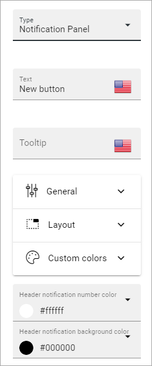

The settings here are used the same way as in the block, see: :doc:`The Notification panel block </blocks/notification-panel/index>`

Omnia admin
-------------
If you need to add the possibility to go to Omnia admin through a button, for those with the right permissions, you can add it on any page through this block.

(Only general settings are available, see above).

Page feedback
----------------
This action makes it possible for a user to send feedback on a publishing page.

(Only general settings for the button are available, see above).

It works this way:

A user clicks the button, adds a feedback message and clicks SEND.

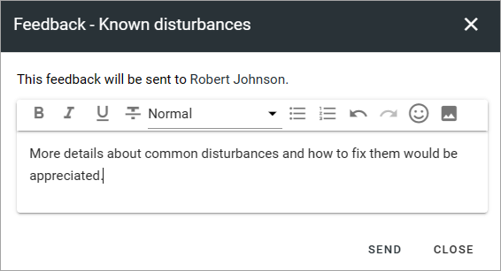

Information about who the feedback is sent to is shown, for example:

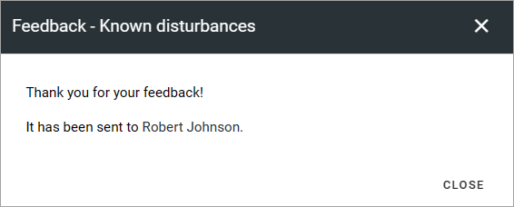

Unlike the Page feedback block (where the feedback can be accessed in the block in Write mode), the feedback sent this way is available, in Design mode or Write mode, in the menu:

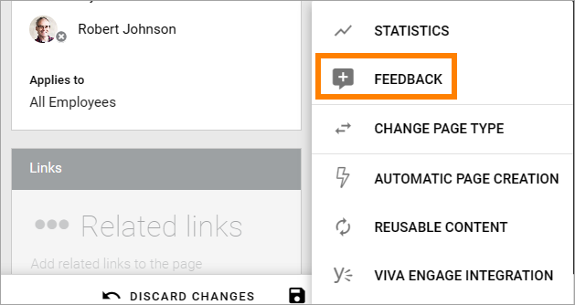

Here's and example:

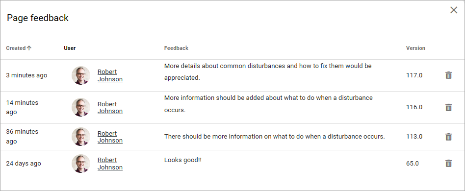

For this to work, "Receive Email" must be selected in the page contact property settings. 

Process Feedback
----------------------
This action makes it possible for a user to send feedback on a process page.

The feedback will be sent to the process owner and will be available in the teamsite where the process can be edited. Feedback can be accessed on the PUBLISHED tab using the menu option "Feedback". Also note that the button must be placed in a process context to work.

(Only general settings for the button are available, see above).

Quick search
---------------
Using this action quick search can be used, like it can in the Search block.

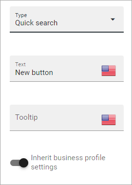

+ **Inherit business profile settings**: You can inherit the search settings from the business profile and if that is what you want to do, you don’t need to change anything, it’s default. If you would like to set specific category settings for this block, deselect and the following will be available:

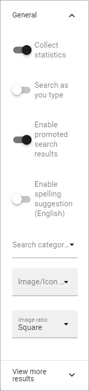

You use these settings the same way as in the Search block. For more information, see: :doc:`The Search block </blocks/search/index>`

Share
--------
Share can be available through the Likes and comments block, but can also be added as an action button:

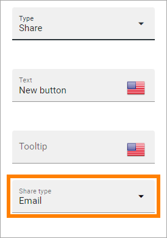

+ **Share type**: Select in what way users should be able to share a link to this page; Email, Teams or Viva Engage (former Yammer).

**Note!** For sharing through Email to work, the recepient's account must be Email enabled.

Sign-off request
-----------------
Use this to add an action button for sign-off requests.

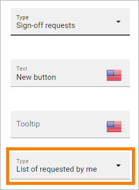

+ **Type**: You can choose between "List of requested by me", "End-user sign-off" and "Create new request".

The "List of requested by me" displays all sign-off requests the logged in administrator has sent, indicating what has happened so far. Here's an example:

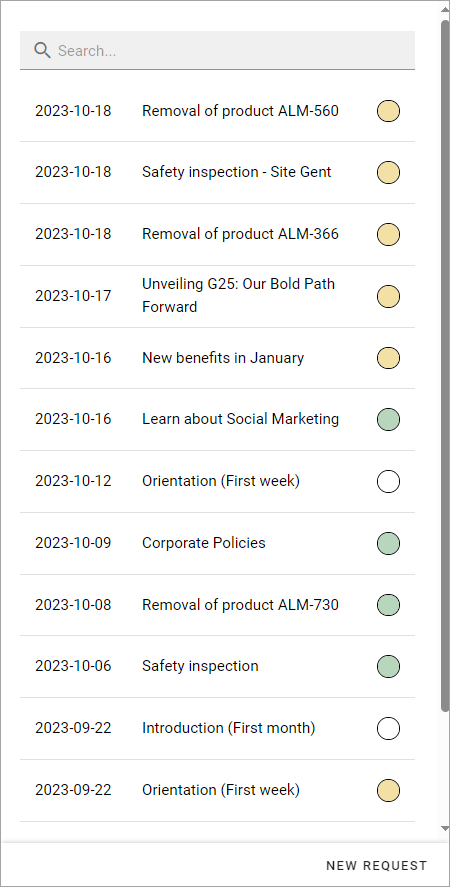

The colored dots indicates the number of answers: white for none, yellow for some and green for all that the request was sent to.

Also note the NEW REQUEST link at the bottom of the list. That link can be used do create a new sign-off request the same way as in Omnia admin, see the "Requests" link below.

An "End-user sign-off" button is used to make it possible for users to sign-off a page by clicking the button. If there is a sign-off request for a page, the button will be shown there, otherwise not.

The purpose of "Create new request" is to make it possible to create a new sign-off request on any page. When creating the button, select type of request that should be possible to create. The sign-off types are set up in Omnia admin, see: :doc:`Sign-off request types </admin-settings/tenant-settings/sign-off-requests-613/sign-off-types-613/index>`

A new request can be created the same way as described on this page: :doc:`Requests </admin-settings/tenant-settings/sign-off-requests-613/sign-off-request-requests-613/index>`

Strengthen profile
----------------------
Strengthen profile can be available as a block (Profile completion) or available in the action menu. It can also be added as an action button.

It works the same way as in the Profile completion block: :doc:`The Profile completion block </blocks/user-profile-completion/index>`

(Only general settings for the button are available, see above).

Subscribe
-----------
This action can be added to the menu in a community but can also be added as a button on a page for a community or a publishing channel, with these settings:

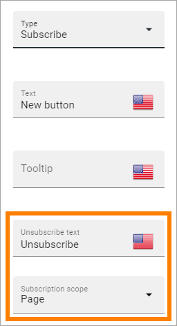

+ **Unsubscribe text**: A "Subscribe" button changes the text automatically when a user has clicked the button. Unsubscribe is suggested but you can change the text to something else.  
+ **Subscription scope**: Select the scope here, meaning what the user actually subscribes to; the page in a community (= all changes to the page, even comments and best reply for knowledge pages), the publishing app, meaing the community app (= all new pages in the app, but not changes to existing pages) or the page collection for the community (= all new pages in the page collection, but not changes to existing pages). The scope can also be a publishing channel.
+ **Publishing channel**: If publishing channel was set as scope, use this list to select channel.

**Note!** Regarding publishing apps - subscription is only meant to be used in communities. For more information, see: :doc:`Subscriptions in Communities </using-communities/subscriptions/index>`

Teamwork navigation
---------------------
The purpose of this button is to create a teamwork navigation, like the one that can be availble from the workspace header.

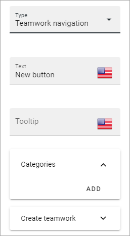

You can add categories (tabs) to display and you can work with a number of details for what is actually shown under each category. Using the option "Create teamwork" you can decide if it should be possible to create an app from here, and how it will work in that case.

Note that a category is basically a team collaboration rollup, so if you think along this line when you edit the settings for a category, you're on the right track.

You can add categories this way:

+ Click ADD.

The following settings are available:

.. image:: teamwork-navigation-button-add-settings-v7.png

These are the same settings as used when editing header settings for workspace. See the heading "Teamwork navigation - additional settings" on this page for more information: :doc:`Header for workspace </admin-settings/business-group-settings/workplace/header/index>`

The following is available under "Create teamwork":

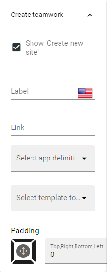

+ **Show Create new site**: If it should not be possible to create a new site here, deselect this option. Note that the default for this option is selected.

When the above option is selected, the following settings are available:

+ **Label**: You can add another label for the option if needed.
+ **Link**: If Omnia default settings are used, this field should be empty. If this link should other an other page than defaul, add the link here.
+ **Select app definition**: Choose the kind of app that should be possible to create here: Publishing, Community or Teamwork.
+ **Select template**: Select one or more templates that should be availble to chose from when creating the app. The templates are set up in Omnia Admin and different templates will be available depending on app definition selected.

You work with the settings here the same way as in the Create app block so additional information kan be found there: :doc:`The Create app block </blocks/create-app/index>`

Tutorial
---------
The purpose of this button is to add the possibility to open the tutorial for this page, if there is one. The button is not shown if there is no tutorial available.

(Only general settings for the button are available, see above).

For more information about tutorials, see: 

+ :doc:`Tutorial </admin-settings/tenant-settings/tutorial/index>`
+ :doc:`Tutorial implementation example </admin-settings/tenant-settings/tutorial/tutorial-implementation/index>`

Button Style
*******************
These settings are available for style (available to the right of GENERAL for most buttons, see image above):

.. image:: action-button-65-style.png

+ **Button style**: You can select Depressed, Flat or Raised as the style. Note that a flat button doesn't have any background color, so the text should normally be black for a flat button.
+ **Size**: The size of the button can be small, medium or large.
+ **Round**: For round button edges, select this option.
+ **Outline**: For an outlined button, select this option. Note that the outline has the same color as the text, and there's no background color, so the text color should normally be black, if you select Outline.
+ **Fill**: If the button should fill the whole width of the block, select this option.
+ **Background color and Text color**: Choose colors here. Note the comments about Flat button style and Outline above.
+ **Icon Type**: To add an icon to the buttton, first select the icon type here.
+ **Icon**: When you have selected the icon type, select the icon in this list. The icon is placed to the left of the button text.
+ **Icon Alignment**: Select the alignment of the buttons within the block area.

Style
******
These Style settings are available on the Style tab, below the Actions tab:

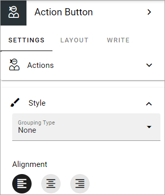

+ **Grouping type**: Here you can choose to group the buttons in the block, by selecting "Dropdown".
+ **Alignment**: Here you can set alignment for alla buttons in the block.

Layout
*********
The LAYOUT tab contains general settings, see: :doc:`General block settings </blocks/general-block-settings/index>`

Write
******
On this tab you decide if settings for the block (the buttons) should be available for editing in Write mode or not. 

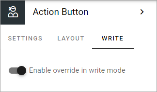

Action button order
*********************
With several buttons in the block you can decide the order. Click the left-most icon and use drag and drop.

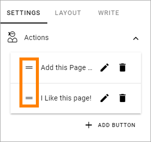

Edit an action button
**********************
To edit a button, click the pen. To delete a button, click the dustbin. 

When editing a button, the same settings as when you create a new button is available, see above.

