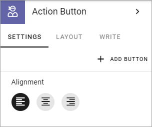
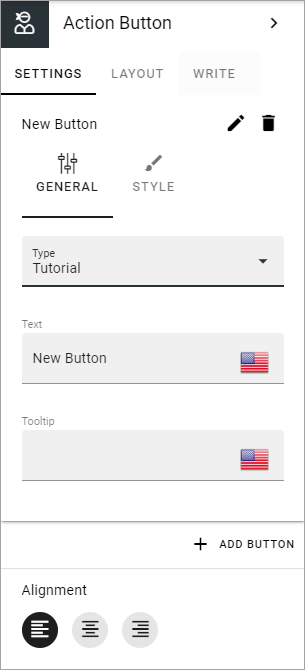
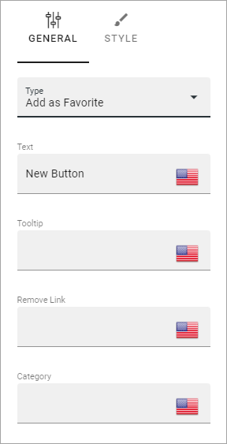
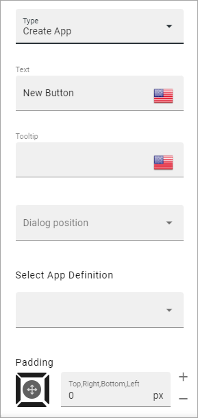
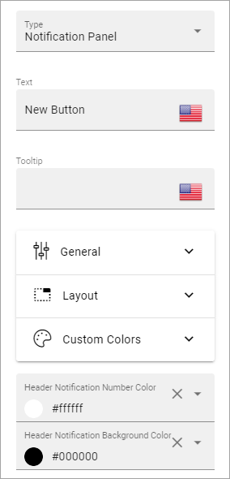
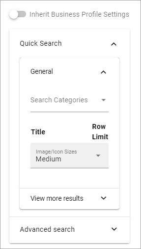
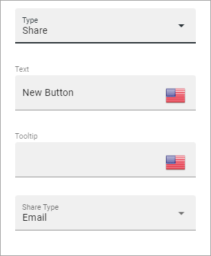
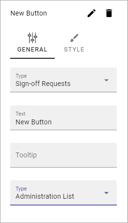
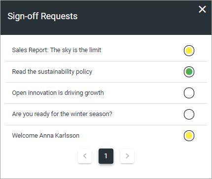

Action Button
=========================================

Use this block to add one or more actions activated by buttons on a page.

All actions that can be added to an Action Menu can also be added as an action button. Now you can create access to these actions the way that suits your organization.

The following actions are available to add as a button:

+ Add as Favourite
+ Create App
+ Create Document
+ Create Page
+ Event Management
+ Export Process
+ Invite co-authors
+ Like
+ Link
+ My Links
+ My Subscriptions
+ Notification Panel
+ Omnia Admin
+ Process Feedback
+ Quick Search
+ Share
+ Sign-off Requests
+ Strenghten Profile
+ Subscribe
+ Teamwork Navigation
+ Tutorial

Settings
***********
The following settings are available:

Add an Action Button
***********************
Note that you can see a preview of the button/buttons in the block as you're working on it.

To add an Action Button in this block, do the following:

1. Click ADD BUTTON.
2. Use the following settings:

General
**********
Available settings differ depending on type of button chosen. The following settings are available for all types:

+ **Type**: Select type of button here. 
+ **Text**: Add text to be shown on the button. If variations exists for the page, you add text in the default language here. Other languages are handled by the variation. If no varations exists, you can add text in several languages here (click the flag to change language).
+ **Tool tip**: Add the tool tip text for the button here. (Same apply for variations as above.)
+ **Alignment**: Select alignment of the button text here. Left is default.

Add as Favourite
------------------
The purpose of this action is for the logged in user to add a Favourites link for a page:

+ **Remove link**: When a favourites link has been added, the text on the button changes so the user can remove the page from the favourites list. Add that text here. 
+ **Category**: If the Favourite link should be added to a specific Category, type the name of the category here. It can be a new or an existing category.

Create App
------------
The purpose of this action is to make it possilble for users to create an Omnia app, just like the Create App block.

The following settings are available for this purpose (se above for the general ones):

+ **Dialog position**: Select position for the dialog that will open; Center or Right.
+ **Select App definition**: Publishing, Community or Teamwork.
+ **Select Template to show**: When you have selected App Definition, here you select the template(s) that should be available. A list of all available templates for the definition is shown. You select one or more templates there.
+ **Padding**: Add some padding in the block if needed.

Create Document
----------------
The purpose of this action is to make it possible to create a document. When the button is clicked, the Create New Document Wizard starts. See this page for more information:

:doc:`Using the Create New Document Wizard </working-with-documents/using-the-document-wizard/index>`

(Only general settings are available, see above).

Create Page
-------------
Using this button the action Create Page can be executed:

.. image:: action-button-create-page.png

+ **Page Collection**: Select page collection to create the new page in.

Event Management
------------------
Using this type you can add buttons for Event Management Actions:

.. image:: action-button-event-management.png

+ **Button Type**: Decide what this button will do; Sign Up, Sign Up Other, Add To Outlook or Cancel. 

+ Sign Up: Used by the logged in user to register for an event. 
+ Sign Up Other: Used by the logged in user to register others - colleagues or external partners - for an event.
+ Add To Outlook: In the case Event Management is set up to use a specific calendar, this button can be added to make it possible for users to add the event to their personal calendar.
+ Cancel: Used by the logged in user to cancel the registration he or she has made in their own name, ie done by using the button "Sign Up". 

For more information about how the buttons work and more useful tips for Event Management, see: :doc:`Working with Events </working-with-events/index>`

Invite co-authors
-------------------
This action is available for authors in the Action Menu, when editing a page. It can also be added as an Action Button.

For more information, see: :doc:`Invite co-authors </pages/invite-co-authors/index>`

(Only general settings are available, see above).

Like
-------
Page Likes and Comments can be added as a block on a page, but the Like action can also be added as an Action Button:

.. image:: action-button-like.png

+ **Unlike Text**: When a user has liked a page, the text on the button changes to "Unlike". If you want some other unlike-text, edit the text here.
+ **Target**: Target can only be Page for now and is selected by default.

Link
------
Using this action a Link Action can be added, meaning a link can be opened:

+ **Url**: Type or paste the Url to go to when a user clicks the link. 
+ **Anchor Name**: Type the Anchor Name in this field to create a link to an anchor.
+ **Target**: Choose if the link should be opened in a new window, the current window, or in a dialog. 
+ **Dialog Position**: If you selected "Dialog" for Target, you can select where to place the dialog: Center, Full screen, Left or Right. 

**Note!** Dialog is not suitable for external links. Select "Current Window" or " New Window" for external links.

For more information about how to work with, and link to anchors, see: :doc:`Using Anchors </general-assets/using-anchors/index>`

My Links
---------
Using this action the logged in users My Links can be shown.

See this page for more information: :doc:`My Links </user-options/my-links/index>`

(Only general settings are available, see above).

My Subscriptons
----------------
My Subscriptions is available in a person's "My Profile" menu but can also be added as an Action Button:

Subscriptions are meant to be used in Communities, for now. See this page for more information: :doc:`My Subscriptions </using-communities/subscriptions/my-subscriptions/index>`

(Only general settings are available, see above).

Motification Panel
--------------------
Using this Action Button a Notification Panel can be shown just like it is in the Notification Panel block.

The settings here are used the same way as in the block, see: :doc:`The Notification Panel block </blocks/notification-panel/index>`

Omnia Admin
-------------
If you need to add the possibility to go to Omnia Admin, for those with the right permissons, you can add this Action Button.

(Only general settings are available, see above).

Process Feedback
----------------------
This action makes it possible for a user to send feedback on a Process page.

The feedback will be sent to the process owner and will be available in the team site where the process can be edited. Feedback can be accessed on the PUBLISHED tab using the menu option "Feedback". Also note that the button must be placed in a Process Context to work.

(Only general settings for the button are available, see above).

Quick Search
---------------
Using this action Quick Search can be used, like it can in the Search block.

.. image:: action-button-quick-search.png

+ **Inherit Business Profile Settings**: You can inherit the search settings from the Business Profile and if that is what you want to do, you don’t need to change anything, it’s default. If you would like to set specific category settings for this block, deselect and the following will be available:

You use these settings the same way as in the Search block. For more information, see: :doc:`The Search block </blocks/search/index>`

Share
--------
Share can be available through the "Likes and Comments" block, but can also be added as an Action Button:

+ **Share Type**: Select in what way users should be able to share a link to this page; Email, Teams or Yammer.

Sign-off request
-----------------
Use this to add an Action button for Sign-off requests.

+ **Type**: You can choose between "Administration List" and "End-user sign-off".

The Administration List, displays all Sign-off requests the logged in administrator has sent, indicating what has happened so far. Here's an example:

The colored dots indicates the number of answers: white for none, yellow for some and green for all that the request was sent to.

The End-user sign off displays the same as the Sign-off Request Rollup block does. See this page for an example: :doc:`The Sign-off Request Rollup block </blocks/sign-off-request/index>`

Strengthen Profile
----------------------
Strengthen profile can be available as a block (Profile Completion) or available in the Action Menu. It can also be added as an Action Button.

It works the same way as in the Profile Completion block: :doc:`The Profile Completion block </blocks/user-profile-completion/index>`

(Only general settings for the button are available, see above).

Subscribe
-----------
This action can be added to the menu in a community but can also be added as a button on a page for a community or a Publishing Channel, with these settings:

.. image:: action-button-subscribe-new.png

+ **Unsubscribe Text**: A "Subscribe" button changes the text automatically when a user has clicked the button. Unsubscribe is suggested but you can change the text to something else.  
+ **Subscription Scope**: Select the scope here, meaning what the user actually subscribes to; the Page (= all changes to the page, even comments and best reply for Knowledge pages), Publishing App (= all new pages in the Publishing App, but not changes to existing pages) or Page Collection (= all new pages in the Page Collection, but not changes to existing pages). The Scope can also be a Publishing Channel.
+ **Publishing Channel**: If Publishing Channel was set as Scope, use this list to select channel.

Button Style
*******************
These settings are available for Style (Available to the right of GENERAL for most buttons, see image above):

.. image:: action-button-65-style.png

+ **Button Style**: You can select Depressed, Flat or Raised as the style. Note that a flat button doesn't have any background color, so the text should normally be black for a flat button.
+ **Size**: The size of the button can be small, medium or large.
+ **Round**: For round button edges, select this option.
+ **Outline**: For an outlined button, select this option. Note that the outline has the same color as the text, and there's no background color, so the text color should normally be black, if you select Outline.
+ **Fill**: If the button should fill the whole width of the block, select this option.
+ **Background Color and Text Color**: Choose colors here. Note the comments about Flat button style and Outline above.
+ **Icon Type**: To add an icon to the buttton, first select the Icon Type here.
+ **Icon**: When you have selected the Icon Type, select the icon in this list. The icon is placed to the left of the button text.
+ **Icon Alignment**: Select the alignment of the buttons within the block area.

Style
******
These Style settings are available here:

.. image:: action-button-style-all.png

+ **Grouping Type**: Here you can choose to group the buttons in the block, by selecting "Dropdown".
+ **Alignment**: Here you can set alignment for alla buttons in the block.

Layout
*********
The LAYOUT tab contains general settings, see: :doc:`General Block Settings </blocks/general-block-settings/index>`

Write
******
On this tab you decide if settings for the block (the buttons) should be available for editing in Write mode or not. 

.. image:: action-button-write.png

Action Button order
*********************
With several buttons in the block you can decide the order. Click the left-most icon and use drag and drop.

.. image:: action-button-order.png

Edit an Action Button
**********************
To edit a button, click the pen. To delete a button, click the dustbin. 

When editing a button, the same settings as when you create a new button is available, see above.

