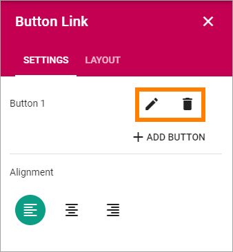
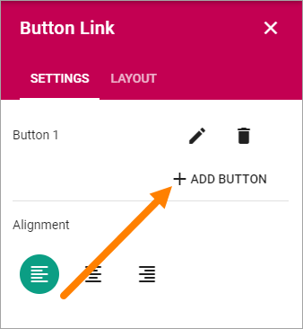
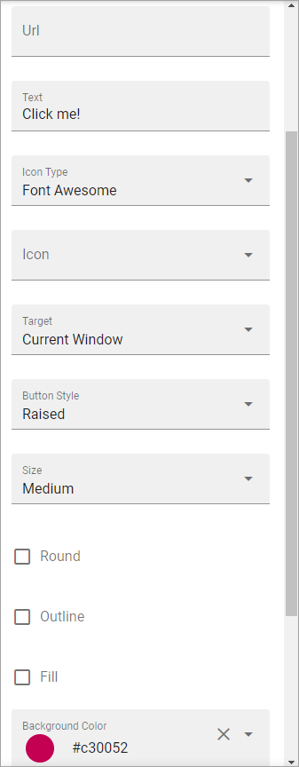

Button Link
=====================

Use this block to add clickable buttons anywhere on a page.

Settings
***********
The following settings can be used:

.. image:: button-link-settings.png

Any existing Button Links in this block are listed at the top. To edit a button, click the pen. To delete a button, click the dustbin.

Note that you can see a preview of the button/buttons in the block as you're working on it (but the buttons are not saved and shown for others until you publish the page).

Add a Button Link
*******************
To add a Button Link in this block, do the following:

1. Click "+ ADD BUTTON".

2. Use the following settings:

(All options are not shown in the image.)

+ **Url**: Type or paste the Url to go to when a user clicks the link.
+ **Text**: If there should be some text on the button, add it here.
+ **Icon Type**: To add an icon to the buttton, first select the Icon Type here.
+ **Icon**: When you have selected the Icon Type, select the icon in this list. The icon is placed to the left of the button text.
+ **Target**: Choose if the link should be opened in a new window, the current window, or in a dialog.
+ **Button Style**: You can select "Depressed", "Flat" or "Raised" as the style. Note that a flat button doesn't have any background color, so the text should normally be black for a flat button.
+ **Size**: The size of the button can be small, medium or large.
+ **Round**: For round button edges, select this option.
+ **Outline**: For an outlined button, select this option. Note that the outline has the same color as the text, and there's no background color, so the text color should normally be black, if you select Outline.
+ **Fill**: If the button should fill the whole width of the block, select this option.
+ **Background Color and Text Color**: Choose colors here. Note the comments about Flat button style and Outline above.
+ **Alignment**: (A description will be added later).

Layout
********
The Layout tab contains general settings, see: :doc:`General Block Settings </blocks/general-block-settings/index>` 
