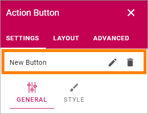
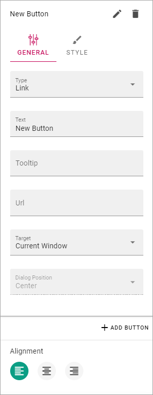

Action Button
=====================

Use it to add one or more buttons on a page for clickable links, for Create Page buttons, to show My subscriptions or to subscribe/unsubscribe. You can add one more buttons in each Action Button block. (This option was formerly called Button Link). 

Settings
***********
Any existing buttons in this block are listed at the top. If no previous button exists, a "New Button" is added automatically. 

To edit a button, click the pen (if just the first, automatic button is present, you don't have to do that, then the settings are shown automatically). To delete a button, click the dustbin. When editing a button, the same settings as when you create a new button is available, see below.

.. image:: button-link-settings-edit-delete-new2.png

Note that you can see a preview of the button/buttons in the block as you're working on it (but the buttons are not saved and shown for others until you publish the page).

The tabs Layout and Advanced contain general settings, see: :doc:`General Block Settings </blocks/general-block-settings/index>`

Add an Action Button
***********************
To add an Action Button in this block, do the following:

1. Click "+ ADD BUTTON".

.. image:: button-link-settings-add-button-new2.png

2. Click the pen for the new button and use the following settings:

(All options are not shown in the image above, but listed below).

The General tab
-------------------
The following settings are available in this tab:

+ **Type**: Select type of button here; Link, Create Page, My Subscriptions or Subscribe.
+ **Text**: If there should be some text on the button, add it here.
+ **Tool tip**: Add the tool tip text for the button here.
+ **Unsubscribe Text**: A "Subscribe" button changes the text automatically when a user has clicked the button. Unsubscribe is suggested but you can change the text to something else.
+ **Subscription Scope**: Available for Type Subscription. Select the scope here, meaning what the user actually subscribes to; the Page, Publishing App (=all pages in) or Page Collection (=all pages in).
+ **Url**: Type or paste the Url to go to when a user clicks the link. Available for Link type.
+ **Target**: Choose if the link should be opened in a new window, the current window, or in a dialog. Available for Link type.
+ **Dialog Position**: If you selected "Dialog" for Target, you can select where to place the dialog: Center, Full screen, Left or Right.
+ **Page Collection**: If you selected "Create Page" as type, select page collection to create the new page in.

The Style tab
---------------
The following settings are available here:

.. image:: action-button-style.png

+ **Button Style**: You can select "Depressed", "Flat" or "Raised" as the style. Note that a flat button doesn't have any background color, so the text should normally be black for a flat button.
+ **Size**: The size of the button can be small, medium or large.
+ **Round**: For round button edges, select this option.
+ **Outline**: For an outlined button, select this option. Note that the outline has the same color as the text, and there's no background color, so the text color should normally be black, if you select Outline.
+ **Fill**: If the button should fill the whole width of the block, select this option.
+ **Background Color and Text Color**: Choose colors here. Note the comments about Flat button style and Outline above.
+ **Alignment**: (A description will be added later).
+ **Icon Type**: To add an icon to the buttton, first select the Icon Type here.
+ **Icon**: When you have selected the Icon Type, select the icon in this list. The icon is placed to the left of the button text.
+ **Alignment**: This option is available on both tabs. Select the alignment of the buttons within the block area.

