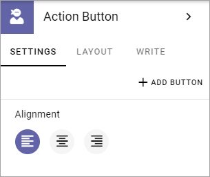
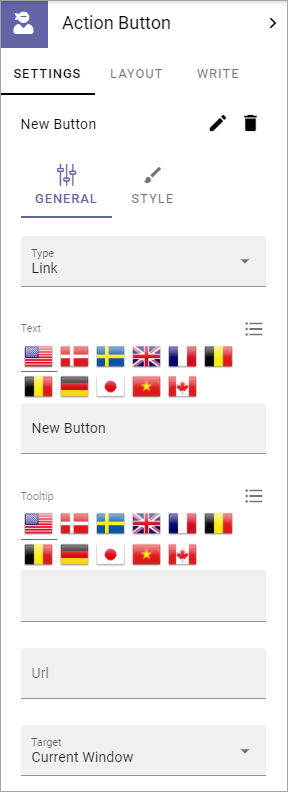
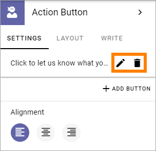

Action Button
=====================

Use this block to add one or more buttons on a page for clickable links or other actions; Create Page buttons, to show My subscriptions, to subscribe/unsubscribe or to send feedback for a process. This block is also used when using Event Management.

You can add one more buttons in each Action Button block. (This option was formerly called Button Link). 

In Omnia 6.5 and later, this block has additional options. You will be able to add action buttons for more purposes. All actions you can add to the action menu will also be possible to add as an action button. Among the new options will be actions for sharing a page to a Yammer feed or to Teams. For more information, see: :doc:`Action button in Omnia 6.5 and later </blocks/button-link/action-button-65/index>`

Settings
***********
The following settings are available:

Add an Action Button
***********************
Note that you can see a preview of the button/buttons in the block as you're working on it.

To add an Action Button in this block, do the following:

1. Click "+ ADD BUTTON".
2. Use the following settings:

(All options are not shown in the image above, but listed below).

General
-------------------
The following settings are available here:

+ **Type**: Select type of button here; Link, Add as favourite, Process feedback, Event Management, Create Page, My Subscriptions or Subscribe. 
+ **Text**: Add text to be shown on the button here. If variations exists for the page, you add text in the default language here. Other languages are handled by the variation. If no varations exists, you can add text in several languages here (as in the image).
+ **Tool tip**: Add the tool tip text for the button here. (Same apply for variations as above.)
+ **Category**: Available as "Add Favourite". If the Favourite should be added to a specific Category, add the category here.
+ **Unsubscribe Text**: A "Subscribe" button changes the text automatically when a user has clicked the button. Unsubscribe is suggested but you can change the text to something else. (Same apply for variations as above.)
+ **Subscription Scope**: Available for Type Subscription. Select the scope here, meaning what the user actually subscribes to; the Page (=all changes to the page, even comments and best reply for Knowledge pages), Publishing App (=all new pages in the Publishing App, but not changes to existing pages) or Page Collection (=all new pages in the Page Collection, but not changes to existing pages).
+ **Url**: Type or paste the Url to go to when a user clicks the link. Available for Link type.
+ **Target**: Choose if the link should be opened in a new window, the current window, or in a dialog. Available for Link type.
+ **Dialog Position**: If you selected "Dialog" for Target, you can select where to place the dialog: Center, Full screen, Left or Right.
+ **Page Collection**: If you selected "Create Page" as type, select page collection to create the new page in.
+ **Button Type**: Decide what this button will do; Sign Up, Sign Up Other, Add To Outlook or Cancel. Available for Event Management. (Se below for more information.)
+ **Reserve Text**: Available for Event Management.
+ **Apply Text**: Available for Event Management.

Regarding Process feedback:

The feedback will be sent to the process owner and will be available in the team site where the process is located. Feedback can be accessed on the PUBLISHED tab using the menu option "Feedback".

Also note that the button must be placed in a Process Context to work.

Regarding the options for Button Type (for Event Management):

+ Sign Up: Used by the logged in user to register for an event. 
+ Sign Up Other: Used by the logged in user to register others - colleagues or external partners - for an event.
+ Add To Outlook: In the case Event Management is set up to use a specific calendar, this button can added to make it possible for users to add the event to their personal calendar.
+ Cancel: Used by the logged in user to cancel the registration he or she has made in their own name, ie done by using the button "Sign Up". 

For more information about how the buttons and more works for Event Management, see: :doc:`Working with Events </working-with-events/index>`

Style
---------------
These settings are available for Style:

.. image:: action-button-style-new.png

+ **Button Style**: You can select Depressed, Flat or Raised as the style. Note that a flat button doesn't have any background color, so the text should normally be black for a flat button.
+ **Size**: The size of the button can be small, medium or large.
+ **Round**: For round button edges, select this option.
+ **Outline**: For an outlined button, select this option. Note that the outline has the same color as the text, and there's no background color, so the text color should normally be black, if you select Outline.
+ **Fill**: If the button should fill the whole width of the block, select this option.
+ **Background Color and Text Color**: Choose colors here. Note the comments about Flat button style and Outline above.
+ **Icon Type**: To add an icon to the buttton, first select the Icon Type here.
+ **Icon**: When you have selected the Icon Type, select the icon in this list. The icon is placed to the left of the button text.
+ **Alignment**: This option is available on both tabs. Select the alignment of the buttons within the block area.

Layout
*********
The LAYOUT tab contains general settings, see: :doc:`General Block Settings </blocks/general-block-settings/index>`

Write
******
On this tab you decide if settings for the block (the buttons) should available for editing in Write mode or not. 

.. image:: button-block-write.png

Edit an Action Button
**********************
To edit a button, click the pen. To delete a button, click the dustbin. 

When editing a button, the same settings as when you create a new button is available, see above.

