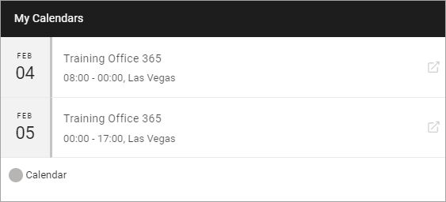
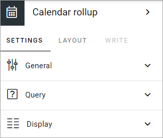
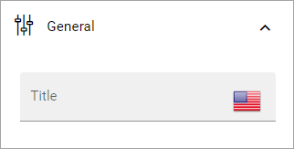
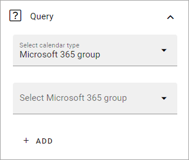
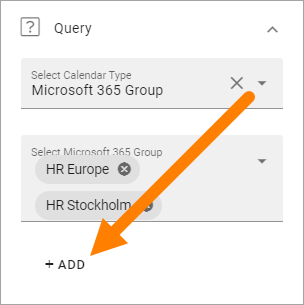

Calendar rollup
================

Use this block to display events from one or more calendars. Note that the calendars are based on Outlook or Exchange, it's not SharePoint calendars.

**Note!** In Omnia on-prem, only personal calendars are supported.

Note that a calendar rollup block can be targeted, see the common layout options: :doc:`General block settings </blocks/general-block-settings/index>`

The user experience
********************
A list of events can look like this for a user:

The user can click the icon to the right of the event to read more.

Settings
*********
Use these settings for the block:

General
---------
Under General you can add a title for the block.

Query
-------
Here you select on or more calendars.

+ **Select calendar type**: You can select to add Microsoft 365 group calendars or the current user's calendar.
+ **Select Microsoft 365 group**: If you have selected "Microsoft 365 group" above you use this field to search for a calendar. 
+ **ADD**: Cilck here to add the calendar. 

When you have added a calendar, additional options are available by expanding the calendar. You can then delete it from the list or set the folliwing:

.. image:: calendar-rollup-additional.png

You can target a calendar using the standard targeting options, see this page for more information: :doc:`Using targeting </general-assets/targeting-in-omnia/index>`

To add a Micorosoft 365 group calendar
--------------------------------------------
Do the following:

1. Select "Microsoft 365 group".
2. Click in the "Select Microsoft 365 group" field and search for calendars.
3. Select one or more calenders.
4. Click "Add".

5. Continue until all calendars are added to the list.

Ta add the current user's calendar
------------------------------------
Do the following:

1. Select "Current user".
2. Click "Add".

Here's an example with two HR calendars and the current user's calendar selected;

.. image:: calendar-rollup-example-new.png

Targeting and color for each calendar
--------------------------------------
Each calendar displayed in the block can be targeted and can be shown with a different color. These settings are available when you expand a calendar:

.. image:: expand-calendar-new.png

.. image:: expand-calendar-expanded-new.png

To select another color, open the list. You can select any of the pre defined colors, or add a custom one.

.. image:: expand-calendar-color-new.png

Targeting a calendar works the same way as in many other parts of Omnia. See this page for more information: :doc:`Using targeting </general-assets/targeting-in-omnia/index>`

You can always target the whole calendar rollup block as an alternative, if calendars should be shown for some and no calendars for others. See the link above.

Display
---------
Here you can set the following:

.. image:: calendar-rollup-display-new4.png

+ **View**: Select the view for the list here. (Only Listing is available for now.)
+ **Item limit**: Set the number of items to display on each "page" of the list.
+ **Padding**: Set some padding around the list if needed.

Layout and Write
*********************
The WRITE TAB is not used here. The LAYOUT tab contains general settings, see: :doc:`General Block Settings </blocks/general-block-settings/index>`

