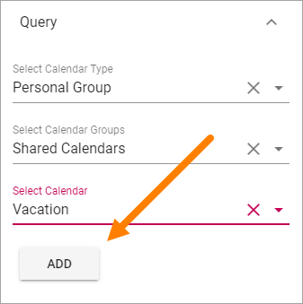
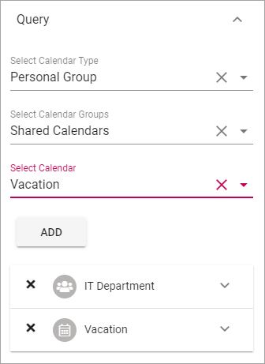
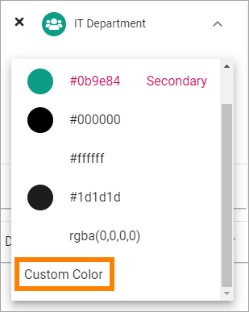

Calendar Rollup
================

Use this block to display events from one or more Calendars. Note that the Calendars are based on Outlook or Exchange, not Sharepoint Calendars.

Note that a Calendar Rollup block can be targeted, see the common Layout options: :doc:`General block settings </blocks/general-block-settings/index>`

Settings
*********
Use these settings for the block:

.. image:: calendar-rollup-settings.png

Query
-------
Use this tab to add calendars.

.. image:: calendar-rollup-query.png

+ **Select Calendar Type**: You can select to add Office Group Calendars or Personal Group Calendars.
+ **Select Calendar Group**: If you have selected "Office Group" above you use this field to search for a calendar. If you selected "Personal Group Calendars" above you select a calendar group: "My Calendars", "Other Calendars", "People's Calendars" or "Shared Calendars".
+ **Select Calendar**: If you select "Personal Group" for Calendar Type, use this list to select a calendar.

To add an Office Group Calendar
--------------------------------
Do the following:

1. Select "Office Group".
2. Click in the "Select Office Group" field and search for a calendar.
3. Select the calender
4. Click "Add".

.. image:: calendar-office-add.png

Ta add a Personal Group Calendar
----------------------------------
Do the following:

1. Select "Personal Group".
2. Open the list "Select Calendar Groups" and select a calendar group.
3. Open the list "Select Calendar" and select the calendar.
4. Click "Add".

5. Continue until all calendars you wish to display in this block are selected. 

Here's an example:

Note that in this example "IT Department" is an office group calendar, and "Vacation" is a shared, personal calendar.

Targeting and Color for each calendar
--------------------------------------
Each calendar displayed in the block can be targeted and can be shown with a different color. These settings are available when you expand a calendar.

.. image:: expand-calendar.png

.. image:: expand-calendar-expanded.png

The select another color, just click the colored dot or the color code. You can select any of the pre defined colors, or add a custom one.

Targeting a calendar works the same way as when you target a block, see the Heading "Targeting" on this page: :doc:`General Block Settings </blocks/general-block-settings/index>`

Display
---------
Here you can set the following:

.. image:: calendar-rollup-display-new2.png

+ **Listing**: In this list you can select type of display (Only Listing is available for now, more options to come).
+ **Title**: If a title should be shown for the block, add it in this field. If no variation exists for the page, it looks like in the image above and you can set the title in the languages active in the tenant. If variation exists, only one title can be set. In that case, titles in other languages are set in the variations.
+ **Item Limit**: Set the number of items to display on each "page" of the list.
+ **Padding**: Set some padding around the list if needed.

Layout and Advanced
**********************
The tabs Layout and Advanced contain general settings, see: :doc:`General Block Settings </blocks/general-block-settings/index>`

