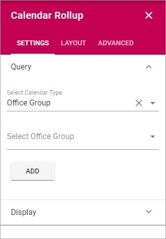
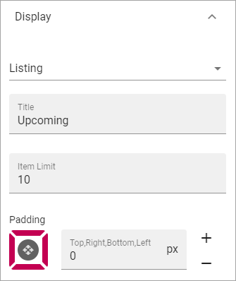

Calendar Rollup
================

Use this block to display events from one or more Calendars. Note that the Calendars are based on Outlook or Exchange, not Sharepoint Calendars.

Note that a Calendar Rollup block can be targeted, see the common Layout options: :doc:`General block settings </blocks/general-block-settings/index>`

Settings
*********
Use these settings for the block:

Query
-------
Use this tab to add calendars.

.. image:: calendar-rollup-query.png

+ **Select Calendar Type**: You can select to add Office Group Calendars or Personal Group Calendars.
+ **Select Calendar Groups**: When the above selection is done, use this list to select a calendar and add it by clickning "Add".

Continue until all Calendars you wish to display in this block are selected.

Display
---------
Here you can set the following:

+ **Listing**: In this list you can select type of display (Only Listing is available for now).
+ **Title**: You can type a Title to be displayd for the block. Not mandatory.
+ **Item Limit**: Set the number of items to display on each "page" of the list.
+ **Padding**: Set some padding around the list if needed.

Layout and Advanced
**********************
The tabs Layout and Advanced contain general settings, see: :doc:`General Block Settings </blocks/general-block-settings/index>`

