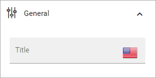

Channel rollup
==============================================

Use this block to rollup publishing channels for easy access for administrators and/or to rollup pending approvals for one or more channels.

For more information, see: :doc:`Publishing channels </admin-settings/tenant-settings/webcontent-managament/publishing-channels/index>`

Settings
*********
The following settings are available for the block:

.. image:: channel-rollup-settings-v75.png

General
----------
Under "General" you can add a block title, if needed, in any or all tenant languages. Click the flag to change language.

Query
---------
Under "Query" you decide what to rollup:

.. image:: channel-rollup-settings-query.png

+ **My administrative channels**: To rollup the pubishing channels the logged in user is administrator for, select this option.
+ **Pending approval**: To rollup pending publishing approval requests in the channels the logged in user can handle, select this option.

Display
---------
The content in this block can only be listed in one way so far, but it still has to selected:

.. image:: channel-rollup-settings-display-1.png

When the view Administration has been selected, you can also select to group the list by categories:

.. image:: channel-rollup-settings-display-2.png

For more information about categories, see: :doc:`Publishing channels categories </aadmin-settings/tenant-settings/webcontent-managament/publishing-channels-categories/index>`

Filter
--------
Here you can choose to display a search field:

.. image:: channel-rollup-settings-filter.png

Layout and Write
******************
The WRITE tab is not used here. The LAYOUT tab contains general settings, see: :doc:`General Block Settings </blocks/general-block-settings/index>`
