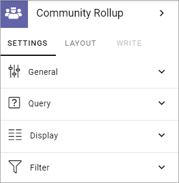
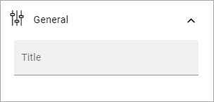
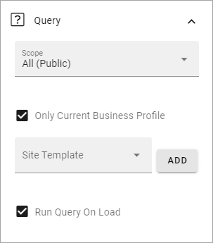
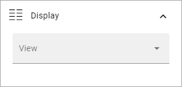
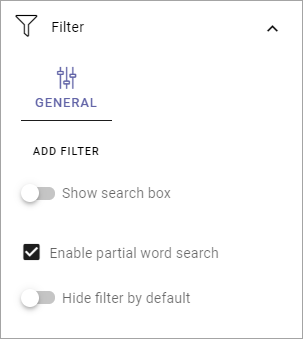

Community Rollup block
=========================

This is an ongoing, preliminary documentation of a new block to come in Omnia 6.5. 

Settings
*************
The following settings is available:

General
---------
Here you can add a title for the block.

Query
-----------
Here you decide what to rollup in the block.

+ **Scope**: You can choose to rollup all public communities, all communities the logged in user follows, or to display the last community the user visited.
+ **Only Current Business Profile**: If only communities from this Business Profile should be listed, select this option (default).
+ **Site Template**: Select template here.
+ **Run Query On Load**: Decide if the query should be run on load, so the list is filled with communities, or not. If a list is very long it can be a good idea to add a search box, and to deselect this option. You add a search box under Filter, see below.

Display
--------
Here ypu can select List View or Card View.

Available settings depends on what you select. All options are listed below.

+ **Add Column**: If you select List View, you must add at least one Column for the display to work.
+ **Cards per Row**: Available for Card view. As it says, set the number of cards to show per row.
+ **Paging**: Select how paging should work; "No Paging", "Classic" or "Scroll".
+ **Image**: Available for Card view. Choose to display an image or not.
+ **Item Limit**: Set the number of sites to be shown on each "page" of the list.
+ **Sort By**: Select what to sort the list on, and then select Ascending or Descending sorting.
+ **Padding**: You can add some padding between the block's borders and the list.
+ **Show Follow status**: Follow status is indicated by a star, filled if the teamwork is followed, hollow if not, see below for an example.
+ **Open in new window**: For some (maybe all) of of the teamworks, it can be a good idea to open the link in a new window.

If you select STYLES for Card View, the following, additional settings becomes available:

.. image:: community-rollup-settings-display-styles.png

Filter
------------------
Here you can add filters so users can filter (= choose to just see some) of a long list.

+ **Add filter**: To add filters, click this link. See below for more information.
+ **Show Search Box**: To add a search box, select this option. You can do that without adding filters.
+ **Enable partial word search**: Per default the search will onfly find whole words, so a search for Chris will find just that, not for example Christina. But if you select this option, the search will find parts of words as well, so both Chris, Christina and Christian, for example.
+ **Hide filter by default**: If you chose a search box you can select this option. Then no filters are shown until users has executed a search and got a search result.

Layout and Write
*********************
The WRITE TAB is not used here. The LAYOUT tab contains general settings, see: :doc:`General Block Settings </blocks/general-block-settings/index>`

