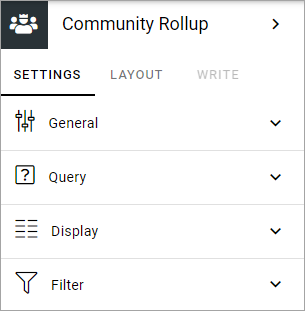
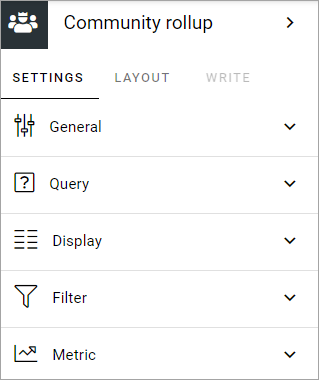
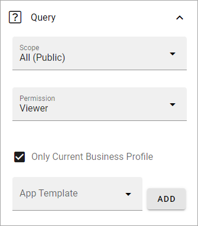
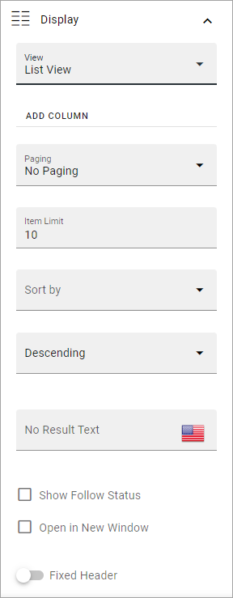
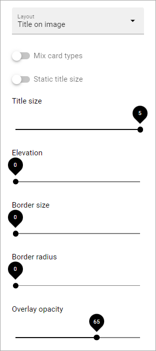
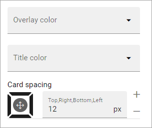
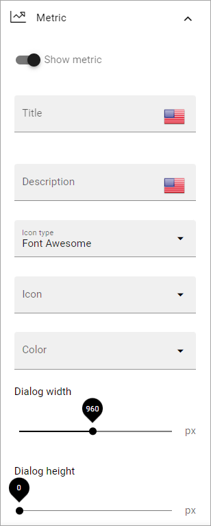

Community rollup block
=========================

The purpose of this block is simply to list all or some or all of the communities that is available in one or more business profiles.

Settings
*************
The following settings is available:

General
---------
Here you can add a title for the block in any available tenant language.

Query
-----------
Here you decide what to rollup in the block. 

+ **Scope**: You can choose to rollup all public communities, all communities the logged in user follows, or to display the last communities the user visited. Last visited, in fact lists all communities the logged in user has visited, with the last visited at the top.
+ **Permission**: Used for security trimming. For more information, see: :doc:`Security trimming in app rollups </general-assets/security-trimming-apps/index>`
+ **Only current business profile**: If only communities from this business profile should be listed, select this option (default).
+ **Site template**: Select community template here. You must select template even if there's just one available.

Display
--------
Here you can select List view or Card view. 

Available settings depends on what you select. All options are listed below (not all are shown in the image).

+ **Add column**: If you select List View, you must add at least one column for the display to work.
+ **Description**: Available for Card View. Set the property to be used for the description.
+ **Date**: Available for Card View. Set the property to be used for the date.
+ **Person**: Available for Card View. Set the property to be used for person information.
+ **Term properties**: For Card view, you can add term properties to be shown on the cards. Click “Add” and select one or more properties.
+ **Cards per row**: Available for Card view. As it says, set the number of cards to show per row.
+ **Paging**: Select how paging should work; "No paging", "Classic" or "Scroll".
+ **Image**: Available for Card view. Choose to display an image or not.
+ **Item limit**: Set the number of sites to be shown on each "page" of the list.
+ **Sort by**: Select what to sort the list on, and then select Ascending or Descending sorting.
+ **No result text**: If you would like a specific text to be shown when there are no coommunities to rollup, according to the settings, add the text here. You can add a message in any available tenant language.
+ **Show Follow status**: Follow status is indicated by a star, filled if the community is followed, hollow if not. If follow status is shown, users can also follow or stop following communities by clicking the star.
+ **Open in new window**: For some (maybe all) of the teamworks, it can be a good idea to open the link in a new window.
+ **Fixed header**: The header of the rollup can be shown all the time (Fixed). If you want that, select this option.
+ **Padding**: You can add some padding between the block's borders and the list.

If you select STYLES for Card view, the following, additional settings becomes available (images from Omnia 7.5):

and these:

Most options should be self-explanatory and besides that, a preview of your choices is shown in the block while you work with it. Comments on three options below:

+ **Mix card types**: Select this option if you would like an automatic mix of card types. Card types are remixed every time the page is loaded. If you click this option on and off a few times while you work with the settings, you can see the mix changing. If you select "Mixed" for "Layout", this option is not available.
+ **Static title size**: If the size of the title always should be the same on all cards, select this option.
+ **Colorful**: Available for some Layout options. It's really colorful! Try it and see what you think.

Filter
------------------
Filter options are the same in most blocks and are described on this page: :doc:`Filter options for blocks </blocks/general-block-settings/filter-options-block/index>`

Metric
*******
Using these settings you can show a metric in the block displaying the number of communities that is valid for the query settings. The metric can then be clicked to display the community rollup you have set up.

This can for example be used to create a rather compact page or section with different metrics in different blocks, that the user can use to click the desired metric to see the full list.

+ **Show metric**: Select this to decide to show the metric.
+ **Title**: Add a title for the metric if needed.
+ **Description**: A description for the metric can also be added.
+ **Icon type/Icon**: Select an icon type and an icon, if you want to.
+ **Color**: This sets the color for the divider above the metric. 
+ **Dialog width/height**: Set width and height for the dialog displaying the list of pages.

Follow and describe to a community
*************************************
When a user chooses to follow a community the user also subscribes to the community automatically.

Layout and Write
*********************
The WRITE TAB is not used here. The LAYOUT tab contains general settings, see: :doc:`General Block Settings </blocks/general-block-settings/index>`

