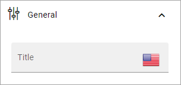
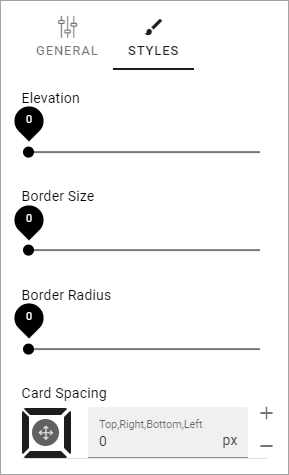
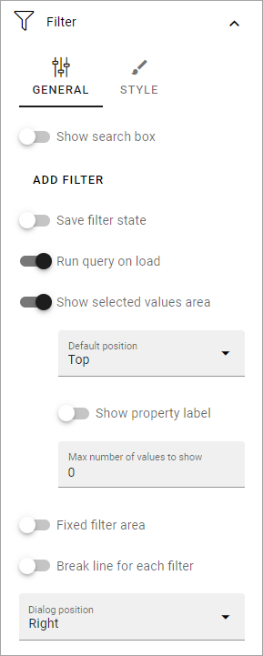

Community rollup block
=========================

The purpose of this block is simply to list all or some or all of the communities that is available in one or more business profiles.

Settings
*************
The following settings is available:

.. image:: community-rollup-settings-all-v7.png

General
---------
Here you can add a title for the block in any available tenant language (click the flag to change language).

Query
-----------
Here you decide what to rollup in the block. (Image from Omnia v7).

.. image:: community-rollup-settings-query-v7.png

+ **Scope**: You can choose to rollup all public communities, all communities the logged in user follows, or to display the last communities the user visited. Last visited, in fact lists all communities the logged in user has visited, with the last visited at the top.
+ **Permission**: Available in Omnia 7.0 and later. Used for security trimming. For more information, see: :doc:`Security trimming in app rollups </general-assets/security-trimming-apps/index>`
+ **Only current business profile**: If only communities from this business profile should be listed, select this option (default).
+ **Site template**: Select community template here. You must select template even if there's just one available.
+ **Run query on load**: Decide if the query should be run on load, so the list is filled with communities, or not. If a list is very long it can be a good idea to add a search box, and to deselect this option. You add a search box under Filter, see below. (This option is moved to the Filter section in Omnia 7.0 and later).

Display
--------
Here you can select List view or Card view. (Image from Omnia v7).

.. image:: community-rollup-settings-display-v7.png

Available settings depends on what you select. All options are listed below (not all are shown in the image).

+ **Add column**: If you select List View, you must add at least one column for the display to work.
+ **Cards per row**: Available for Card view. As it says, set the number of cards to show per row.
+ **Paging**: Select how paging should work; "No paging", "Classic" or "Scroll".
+ **Image**: Available for Card view. Choose to display an image or not.
+ **Item limit**: Set the number of sites to be shown on each "page" of the list.
+ **Sort by**: Select what to sort the list on, and then select Ascending or Descending sorting.
+ **Padding**: You can add some padding between the block's borders and the list.
+ **Show Follow status**: Follow status is indicated by a star, filled if the community is followed, hollow if not. If follow status is shown, users can also follow or stop following communities by clicking the star.
+ **Open in new window**: For some (maybe all) of the teamworks, it can be a good idea to open the link in a new window.

If you select STYLES for Card view, the following, additional settings becomes available:

Filter
------------------
Here you can add filters so users can filter (= choose to just see some) of a long list. Image from Omnia v7.

Filter options in Omnia 7.0 and later are described on this page: :doc:`Filter options for blocks in Omnia v7 </blocks/general-block-settings/filter-options-block/index>`

Follow and describe to a community
*************************************
When a user chooses to follow a community the user also subscribes to the community automatically.

Layout and Write
*********************
The WRITE TAB is not used here. The LAYOUT tab contains general settings, see: :doc:`General Block Settings </blocks/general-block-settings/index>`

