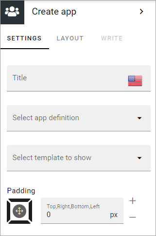
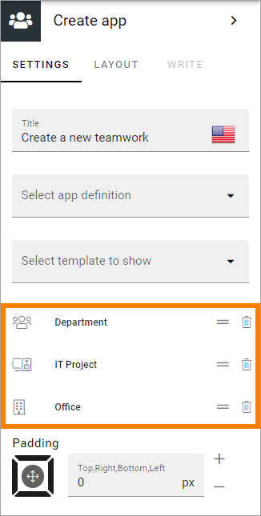
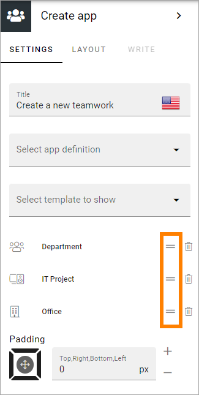
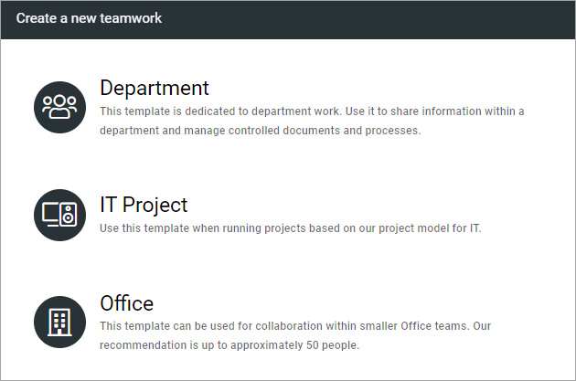

Create app block
===================

A new Omnia app can be created through this block. If you used the Create teamwork block in earlier Omnia versions, Create teamwork is now part of this block.

If you haven't already, the first step is to create the templates in Omnia admin. See below for links to descriptions.

The following settings are available:

+ **Title**: Here you can add a title for the block.
+ **Select app definition**: Select type of app that should be available: Publishing, Community or Teamwork.
+ **Select template to show**: When you have selected app definition, a list of available templates for the app type is shown. You must select the template(s) that should be available, even if the list just contains one. Note that if no templates are set up in Omnia admin, this list is empty.

Here's an example with three templates selected for teamwork:

(Not all teamwork types listed are available in Omnia on-prem.)

To remove a template from the list, click the dust bin. To edit the order, use this icon and drag and drop:

This list will look like this for the user:

For more information on creating app templates in **Omnia v7** versions, see: 

+ :doc:`Templates for communities in Omnia v7 </admin-settings/business-group-settings/communities/communities-v7/templates/index>`

+ :doc:`Templates for publishing apps in Omnia v7 </admin-settings/business-group-settings/publishing-apps/publishing-v7/templates-v7/index>`

+ :doc:`Teamwork templates in Omnia v7 </admin-settings/business-group-settings/team-collaboration/teamwork-v7/templates/index>`

For more information on creating app templates in Omnia versions up to **6.13**, see: 

+ :doc:`Templates for communities </admin-settings/business-group-settings/communities/communities-65/templates/index>`

+ :doc:`Templates for publishing apps </admin-settings/business-group-settings/publishing-apps/publishing-65/templates/index>`

+ :doc:`Teamwork templates </admin-settings/business-group-settings/team-collaboration/teamwork-65/templates/index>`

WRITE is not applicable here. Layout contains general options. For more information, see: :doc:`General Block Settings </blocks/general-block-settings/index>`

