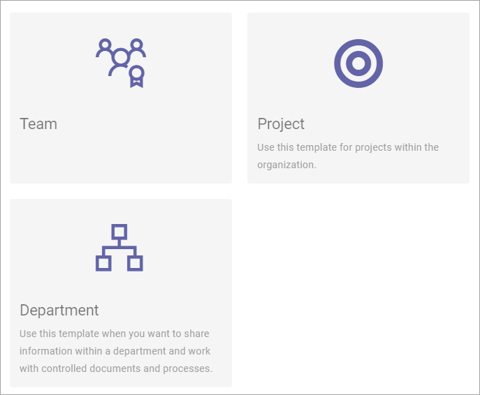

Create Teamwork
==================

Use this block to let users create a teamwork. The block can be placed on any page. 

There must be Provisioning Templates available for the teamworks that should be possible to create. These templates are set up in Omnia Admin. See this page for more information: :doc:`Provisioning Templates </admin-settings/business-group-settings/provisioning-templates/index>`

Settings
*********
These are the settings for the block (example):

.. image:: create-teamwork-settings.png

(All available options in our test environment are shown in the image.)

+ **Title**: You can add a title for the block if you wish.
+ **Select template to show**: Select the templates that should be available here ro users to select when creating the teamwork. The temmplates shown are those that has been set up in your environment in Omnia Admin, see above for a link to the description.
+ **Padding**: You can also add some padding if needed.

To select template(s)m just click in them, and click again to deselect. Here's an example with three templates selected:

.. image:: create-teamwork-selected.png

This would result in the following being displayed for users:

A user just clicks the desired template and the wizard starts, with a number of steps, according to what has been set up for the template.

