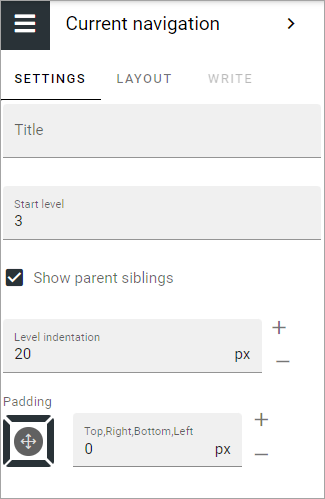

Current navigation
===========================================

The current navigation block makes it possible for the end user to navigate to siblings, parent nodes and parent node siblings. 

.. image:: current-navigation-example.png

The current navigation can be set to be shown, as most blocks can, in all or some of the three display breakpoint settings, available when the block is edited; Extra small, Small, Medium or Large. See the heading "Display settings for blocks" on this page for more information: :doc:`Working with blocks </blocks/working-with-blocks/index>`

The settings
*************
These settings are available:.

+ **Title**: If you would like a title to be shown for the block, add the title here.
+ **Start level**: The current navigation will start on a specific level in the navigation structure. 1 = Start, 2 = Second level, 3= Third level etc. The default value is 3.
+ **Show parent siblings**: To always show all main nodes, select this setting. If not selected, only the current node is shown. See below for examples.
+ **Level indentation**: Set the indendation for each level shown here.
+ **Padding**: Use this option to set a padding for the navigation, withing the block.

Here are two examples of the "Show parent siblings" setting. First WITH Show parent siblings selected:

This is how the same current navigation will look with Show parent siblings NOT selected:

.. image:: show-parent-not-g2.png

Layout and Write
*********************
The WRITE TAB is not used here. The LAYOUT tab contains general settings, see: :doc:`General Block Settings </blocks/general-block-settings/index>`

