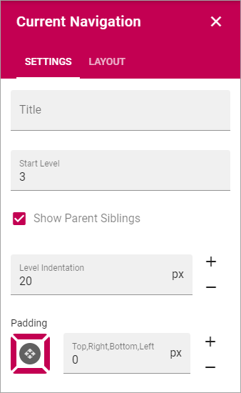

Current Navigation
===========================================

The current navigation block makes it possible for the end user to navigate to siblings, parent nodes and parent node siblings. 

.. image:: current-navigation-example.png

The current navigation settings are page layout scoped. The settings are valid for a specific page layout within the current site collection.

The current navigation is responsive. In a certain width (optimized for mobile phones and tablets) the current navigation will be hidden. The mobile navigation will then be used instead.

.. image:: mobile-navigation.png

The settings
*************
These settings are available:.

+ **Title**: If you would like a title to be shown for the block, add the title here.
+ **Start Level**: The current navigation will start on a specific level in the navigation structure. 1 = Start, 2 = Second level, 3= Third level etc. The default value is 3.
+ **Level indentation**: Set the indendation for each level shown here.
+ **Padding**: Use this option to set a padding for the navigation, withing the block.

