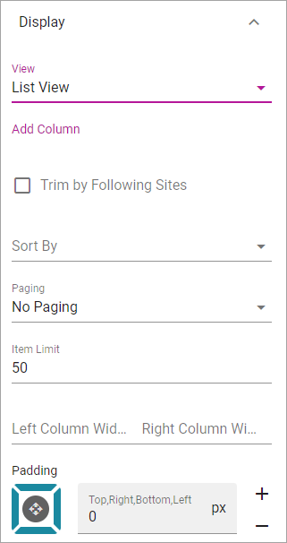
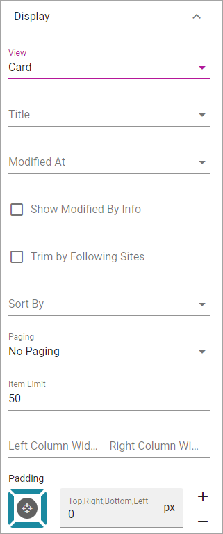
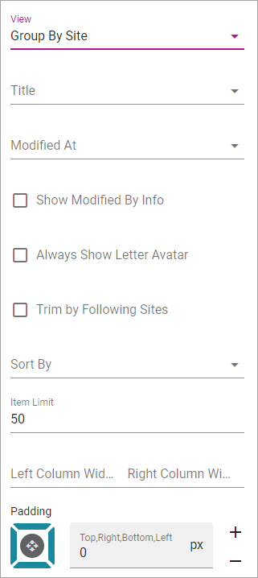
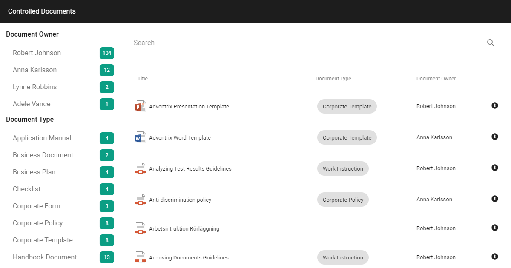
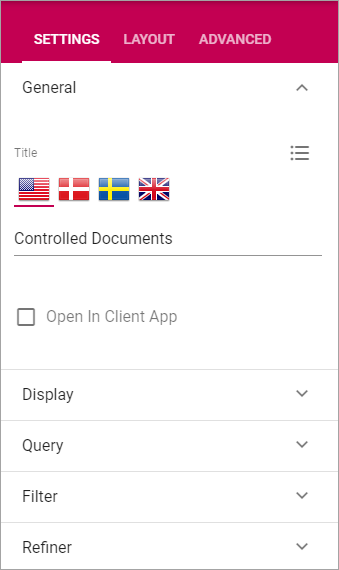
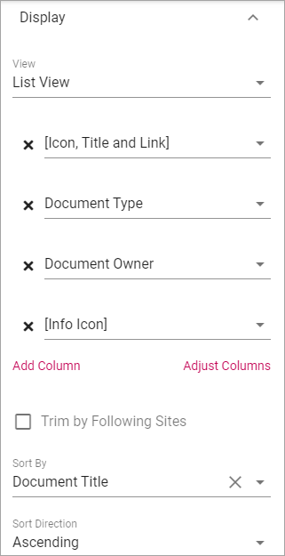
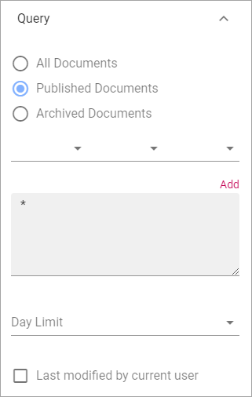
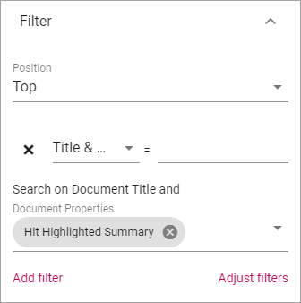

Document Rollup
===========================================

Using The Document Rollup block an administrator can show suitable documents in a list.

The settings
*************************
The following settings are available:

.. image:: document-rollup-settings-new3.png

General
-----------------
Here you can set the following:

.. image:: document-rollup-settings-general-new3.png

+ **Title**: If a title should be shown for the block, add it in this field. If no variation exists for the page, it looks like in the image above and you can set the title in the languages active in the tenant. If variations exists, only one title can be set. In that case, titles in other languages are set in the variations.
+ **Open in Client App**: Documents are by default opened in the online app. If document should be opened in the client app instead, select this option.

Display
---------------
You can select "List View", "Card" and "Group by site" here. Available settings differ depending on your choice.

For **List View** you can set the following:

+ **Add Column**: Select additional columns to show in the list. Icon, Title, Link and Info icon are always shown.
+ **Trim by Following Site**: If this option is selected only documents from sites the logged in user follows are displayed in the list.
+ **Sort By**: Select the column the list should be sorted by.
+ **Paging**: Select paging for the list here. It can be "No paging", "Classic" or "Scroll".
+ **Item Limit**: Set the item limit to display in each "page" of the list.
+ **Left Column Width**: Set the left column width in pixels here.
+ **Right Column Width**: Set the right column width in pixels here.
+ **Padding**: Use this setting for padding around the contents in the block.

For **Card** view the following settings are available:

+ **Title**: Select what to show as the title: "Title", "Document Type", "Document Owner", "Published", Modified or Document Title..
+ **Modified At**: Here you select the information (field) to show for a document.
+ **Show Modified By Info**: Select the option to show who was the last to modify the document.
+ **Trim by Following Site**: If this option is selected only documents from sites the logged in user follows are displayed in the list.
+ **Sort By**: Select the column the list should be sorted by.
+ **Paging**: Select paging for the list here. It can be "No paging", "Classic" or "Scroll".
+ **Item Limit**: Set the item limit to display in each "page" of the list.
+ **Left Column Width**: Set the left column width in pixels here.
+ **Right Column Width**: Set the right column width in pixels here.
+ **Padding**: Use this setting for padding around the contents in the block.

For **Group By Site** these settings are available:

+ **Title**: Select what to show as the title: "Title", "Document Type", "Document Owner", "Published", Modified or Document Title..
+ **Modified At**: Here you select the information (field) to show for a document.
+ **Show Modified By Info**: Select the option to show who was the last to modify the document.
+ **Always Show Letter Avatar**: If letter avatars always should be shown, select this option.
+ **Trim by Following Site**: If this option is selected only documents from sites the logged in user follows are displayed in the list.
+ **Sort By**: Select the column the list should be sorted by.
+ **Item Limit**: Set the item limit to display in each "page" of the list.
+ **Left Column Width**: Set the left column width in pixels here.
+ **Right Column Width**: Set the right column width in pixels here.
+ **Padding**: Use this setting for padding around the contents in the block.

Query
---------
Here you add queries, which is the detailed "settings" for what to display in the list:

.. image:: document-rollup-settings-query-new.png

1. Set scope for the document rollup: 

+ All Documents - always available, meaning ALL documents the logged in user has permissions to read. Use the query settings below to limit what will be shown in the rollup. The rollup can then be set to display just "normal" documents or both normal and controlled documents. To rollup documents from one or more Teams Sites, use this option.
+ Published Documents  - available only if Controlled Documents is active. Meaning ALL published CONTROLLED DOCUMENTS the logged in user has permissions to read. Use the query settings below to limit what will be shown in the rollup.
+ Archived Documents - available only if Controlled Documents is active. Meaning all published Controlled Documents in the Archive. As permissions to read documents in the Archive normally is given to just a few, this is for specialized implementation.

**Note!** Regardless of what you select here, the documents that will be displayed for a user are only those documents that the user has premissions to read.

2. Use the three lists for base settings and the field to add a Query Parameter. 
3. Click "Add" to add the Query. 

Here's a simple example of a Query for displaying documents that are published later than 2019-06-30:

.. image:: documents-query-new2.png

Also see another example under *Implementation example* below.

Note that you can type the script directly in the field, if you know how. You can use all options in the Keyword Query Language (KQL). See this Microsoft page for reference: https://docs.microsoft.com/en-us/sharepoint/dev/general-development/keyword-query-language-kql-syntax-reference

Additionally you can set:

+ **Day Limit**: Use this option to limit the display of older documents. You first select property (for example Modified) and then select how old the documents can be to be displayed in the list.
+ **Last modified by current user**: Use this option to limit the rollup to documents the logged in user has edited, for example for a "MY latest documents" implementation.

Filter
--------
Select filters to show for the list.

.. image:: document-rollup-settings-filter.png

+ **Position**: Set position for the filters here; "Top", "Left" or "Right".
+ **Add filter**: Click this option to add a property for filtering. You can add as many properties that are applicable, and set the detailed settings (for example From - To for "Published").

Refiners
-----------------
Here you select refiners to show for the list:

.. image:: document-rollup-settings-refiners.png

+ **Position**: Set position for the refiners here; "Top", "Left" or "Right".
+ **Add refiner**: Click this option to add a a property to use as a refiner. You can add as many properties as is applicable. For each refiner added you can set sort order; "Alphabetical" or "Count". You can also set a limit.

Layout and Advanced
**********************
The tabs Layout and Advanced contain general settings, see: :doc:`General Block Settings </blocks/general-block-settings/index>`

Implementation example
***********************
Here's an example of how it can look for users when a Document Rollup block is set up for Controlled Documents access:

Note that Document Type is shown and that the list can be refined on Document Owner and Document Type. There's also a Search available.

The following settings are used (see above for more information about the fields and options):

General
--------
Here, just the Title for the list is added in this example:

Display
--------
For Display the following settings are made in this example:

And these:

.. image:: document-rollup-controlled-4.png

The "Classic" Paging results in a navigation at the bottom of the list:

.. image:: document-rollup-controlled-5.png

Query
------
The following settings are made for Query:

Note the star (*) in the Query Field, meaning All (in this case Published Documents).

Filter
--------
The following filters are set up:

"Title & ..." is the option for Search, in this case a search for "Title & Other Properties".

Refiners
-----------
Finally, Refiners are set up this way:

.. image:: document-rollup-controlled-8.png

At the top is the Refiner Option "Document Owner", limited to 5 posts.

Next is the Refiner Option "Document Type" with no limit.

