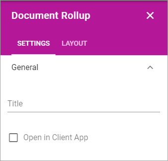
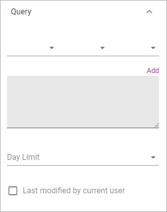

Document Rollup
===========================================

Using The Document Rollup block an administrator can show suitable documents in a list.

The settings
*************************
The following settings are available:

.. image:: document-rollup-settings.png

General
-----------------
Here you can set the following:

+ **Title**: Enter a title to be displayed in the block.
+ **Open in Client App**: Documents are by default opened in the online app. If document should be opened in the client app instead, select this option.

Display
---------------
You can select "List View", "Card" and "Group by site" here. Available settings differ depending on your choice.

For **List View** you can set the following:

.. image:: document-rollup-settings-display.png

+ **Add Column**: Select additional columns to show in the list. Icon, Title, Link and Info icon are always shown.
+ **Trim by Following Site**: If this option is selected only documents from sites the logged in user follows are displayed in the list.
+ **Sort By**: Select the column the list should be sorted by.
+ **Paging**: Select paging for the list here. It can be "No paging", "Classic" or "Scroll".
+ **Item Limit**: Set the item limit to display in each "page" of the list.
+ **Left Column Width**: Set the left column width in pixels here.
+ **Right Column Width**: Set the right column width in pixels here.
+ **Padding**: Use this setting for padding around the contents in the block.

For **Card** view the following settings are available:

.. image:: document-rollup-settings-display-card.png

+ **Title**: Select what to show as the title: "Title", "Document Type", "Document Owner", "Published", Modified or Document Title..
+ **Modified At**: (A description will be added soon).
+ **Show Modified By Info**: Select the option to show who was the last to modify the document.
+ **Trim by Following Site**: If this option is selected only documents from sites the logged in user follows are displayed in the list.
+ **Sort By**: Select the column the list should be sorted by.
+ **Paging**: Select paging for the list here. It can be "No paging", "Classic" or "Scroll".
+ **Item Limit**: Set the item limit to display in each "page" of the list.
+ **Left Column Width**: Set the left column width in pixels here.
+ **Right Column Width**: Set the right column width in pixels here.
+ **Padding**: Use this setting for padding around the contents in the block.

For **Group By Site** these settings are available:

.. image:: document-rollup-settings-display-group.png

+ **Title**: Select what to show as the title: "Title", "Document Type", "Document Owner", "Published", Modified or Document Title..
+ **Modified At**: (A description will be added soon).
+ **Show Modified By Info**: Select the option to show who was the last to modify the document.
+ **Always Show Letter Avatar**: If letter avatars always should be shown, select this option.
+ **Trim by Following Site**: If this option is selected only documents from sites the logged in user follows are displayed in the list.
+ **Sort By**: Select the column the list should be sorted by.
+ **Item Limit**: Set the item limit to display in each "page" of the list.
+ **Left Column Width**: Set the left column width in pixels here.
+ **Right Column Width**: Set the right column width in pixels here.
+ **Padding**: Use this setting for padding around the contents in the block.

Query
---------
Here you add queries, which is the detailed "settings" for what to display in the list:

(A description will be added soon.)

Filter
--------
Select filters to show for the list.

.. image:: document-rollup-settings-filter.png

+ **Position**: Set position for the filters here; "Top", "Left" or "Right".
+ **Add filter**: Click this option to add a property for filtering. You can add as many properties that are applicable, and set the detailed settings (for example From - To for "Published").

Refiners
-----------------
Here you select refiners to show for the list:

.. image:: document-rollup-settings-refiners.png

+ **Position**: Set position for the refiners here; "Top", "Left" or "Right".
+ **Add refiner**: Click this option to add a a property to use as a refiner. You can add as many properties as is applicable. For each refiner added you can set sort order; "Alphabetical" or "Count". You can also set a limit.
