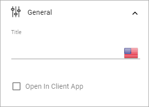
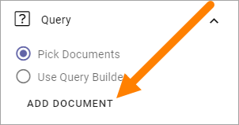
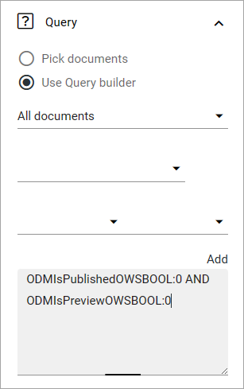
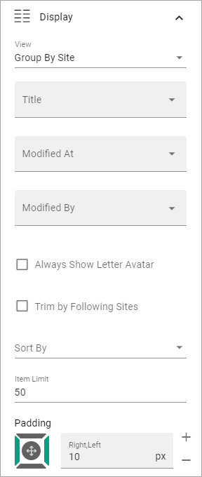
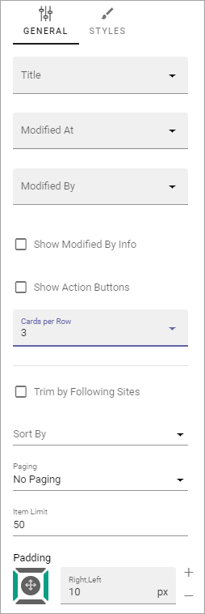
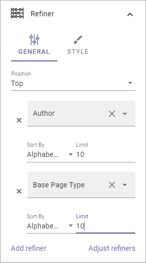
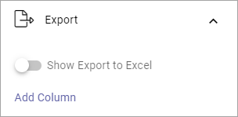

Document rollup
===========================================

Using The Document rollup block you can display suitable documents in a list. 

For implementation examples, see this page: :doc:`Document rollup implementation examples </blocks/document-rollup/document-rollup-implementation/index>`

Settings
*************************
The following settings are available:

.. image:: document-rollup-settings-all-new3.png

General
-----------------
Here you can set the following:

+ **Title**: If a title should be shown for the block, add it in this field. The title can be added in any, or all tenant languages. Click the flag to change language.
+ **Open in client app**: Documents are by default opened in the online app. If document should be opened in the client app instead, select this option.

Query
---------
You can either choose to pick documents to be displayed in the block, or use the Query Builder.

.. image:: document-rollup-query-new2.png

Pick ocuments
^^^^^d^^^^^^^^^^^^
To pick documents, click "ADD DOCUMENT".

The document picker opens and you use it to select documents.

.. image:: document-rollup-document-picker-new.png

See this page for more information on how to use the document picker: :doc:`The Document picker </general-assets//document-picker/index>`

Query builder
^^^^^^^^^^^^^^
Here you add queries, which is the detailed "settings" for what to display in the list:

1. Set scope for the document rollup: 

.. image:: document-rollup-settings-query-scope-new2.png

+ **All documents** - always available, meaning ALL documents the logged in user has permissions to read. Use the query settings below to limit what will be shown in the rollup. The rollup can then be set to display just "normal" documents or both normal and controlled documents. To rollup documents from one or more teamsites, use this option.
+ **Published documents**  - available only if the feature Controlled documents is active. Meaning ALL published CONTROLLED DOCUMENTS the logged in user has permissions to read. Use the query settings below to limit what will be shown in the rollup.
+ **Archived documents** - available only if the feature Controlled documents is active. Meaning all published controlled documents in the archive. As permissions to read documents in the archive normally is given to just a few. This is for specialized implementations.

**Note!** Regardless of what you select here, the documents that will be displayed for a user are only those documents that the user has premissions to read.

2. Use the three lists for base settings and the field to add a query parameter. 

.. image:: document-rollup-settings-query-scope-settings.png

3. Click "Add" to add the Query. 

Note that you can type the script directly in the field, if you know how. You can use all options in the Keyword Query Language (KQL). See this Microsoft page for reference: https://docs.microsoft.com/en-us/sharepoint/dev/general-development/keyword-query-language-kql-syntax-reference

Additionally you can set:

.. image:: document-rollup-settings-query-scope-settings2.png

+ **Day limit**: Use this option to limit the display of older documents. You first select property (for example Modified) and then select how old the documents can be to be displayed in the list.
+ **Last modified by current user**: Use this option to limit the rollup to documents the logged in user has edited, for example for a "My latest documents" implementation.

A tip - rolling up drafts
^^^^^^^^^^^^^^^^^^^^^^^^^^
If you would like to rollup all controlled document drafts in the whole tenant, here's how.

1. Use Query builder.
2. Select "All documents".
3. Add the following KQL: ODMIsPublishedOWSBOOL:0 AND ODMIsPreviewOWSBOOL:0

Like this:

Other filters can of course be used, for example to rollup all draft documents for a specific author or regarding a specific product, as long as you remember to select "All documents".

Display and filter settings are done the usual way.

Display
---------------
You can select "List view", "Summary view", "Group by site" and "Card" here. Available settings differ.

For **List view** you can set the following:

.. image:: document-rollup-settings-display-new3.png

+ **Add column**: Select the columns to show in the list. Note! If users should be able to send feedback on controlled documents, add the column "Feedback icon". In the rollups shown in the implementation section below, the Feedback icon is the icon to the far right. An information icon can also be very useful as it displays more information about the document.
+ **Trim by following sites**: If this option is selected only documents from sites the logged in user follows are displayed in the list.
+ **Sort by**: Select the column the list should be sorted by.
+ **Paging**: Select paging for the list here. It can be "No paging", "Classic" or "Scroll".
+ **Item limit**: Shown when No paging is selected. Set the item limit to display in each "page" of the list.
+ **Page size**: Shown when Classic or Scroll paging is selected. Set the item limit to display in each "page" of the list.
+ **Padding**: Use this setting for padding around the contents in the block.

If you select "Adjust columns" - displayed when you have selected columns - you can set the width for the columns, if needed:

.. image:: document-rollup-settings-display-width.png

For **Summary view** these settings are available:

.. image:: document-rollup-settings-summary-view.png

+ **Title**: Select property to to get the title from.
+ **Modified at**: Select the property to get this information from.
+ **Modified by**: Select the property to get this information from.
+ **Trim by following site**: If this option is selected only documents from sites the logged in user follows are displayed in the list.
+ **Sort by**: Select the column the list should be sorted by.
+ **Paging**: Select type of paging here; No paging, Classic or Scroll.
+ **Item limit**: Shown when No paging is selected. Set the item limit to display in each "page" of the list.
+ **Page size**: Shown when Classic or Scroll paging is selected. Set the item limit to display in each "page" of the list.
+ **Padding**: Use this setting for padding around the contents in the block.

For **Group by site** these settings are available:

+ **Title**: Select property to to get the title from.
+ **Modified at**: Select the property to get this information from.
+ **Modified by**: Select the property to get this information from.
+ **Always show letter avatar**: If letter avatars always should be shown, select this option.
+ **Trim by following site**: If this option is selected only documents from sites the logged in user follows are displayed in the list.
+ **Sort by**: Select the column the list should be sorted by.
+ **Item limit**: Set the item limit to display in each "page" of the list.
+ **Padding**: Use this setting for padding around the contents in the block.

For **Card** view the following settings are available:

+ **Title**: Select property to to get the title from.
+ **Modified at**: Select the property to get this information from.
+ **Modified by**: Select the property to get this information from.
+ **Show modified by info**: If it should be shown who the latest version of this document was created by, select this option.
+ **Show action buttons**: Makes the following options available in a menu: "Copy link" and "Source library".
+ **Trim by Following Site**: If this option is selected only documents from sites the logged in user follows are displayed in the list.
+ **Sort by**: Select the column the list should be sorted by.
+ **Paging**: Select paging for the list here. It can be "No paging", "Classic" or "Scroll".
+ **Item limit**: Set the item limit to display in each "page" of the list.
+ **Padding**: Use this setting for padding around the contents in the block.

For Card view, you can also edit card spacing, available under STYLES:

.. image:: document-rollup-settings-display-card-style.png

Filter
--------
Here you can add filters to show for the list, or add a search box.

.. image:: document-rollup-filter-new.png

What you can do here is described on this page: :doc:`Filter UI </blocks/general-block-settings/filters/index>`

In Omnia 7.0 and later, new options for filtering can be available, see: :doc:`Filter options for blocks in Omnia v7 </blocks/general-block-settings/filter-options-block/index>`

Refiner
-----------------
Here you select refiners users can use to refine the list:

.. image:: document-rollup-settings-refiners-new.png

+ **Position**: Set position for the refiners here; "Top", "Left" or "Right".
+ **Add refiner**: Click this option to add a a property to use as a refiner. You can add as many properties as is applicable. For each refiner added you can set sort order; "Alphabetical" or "Count". You can also set a limit.

Here's an example:

Click "Adjust refiners" to edit the order.

Using STYLE you can set the following:

.. image:: document-rollup-settings-refiners-style.png

Test the options and see a preview in the block.

In Omnia 7.0 and later, the Refiner menu option is removed. Refiner options can now be found under "Filter", see: :doc:`Filter options for blocks in Omnia v7 </blocks/general-block-settings/filter-options-block/index>`

Export
*********
Use this settings to display a link for export of the list to Excel.

Layout and Write
*********************
The WRITE Tab is not used here. The LAYOUT tab contains general settings, see: :doc:`General Block Settings </blocks/general-block-settings/index>`

