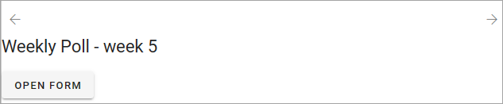

Form rollup
========================

This is a new block in Omnia 7.6. The block can be used for many different purposes. 

**The documentation is just started, more will be added soon.**

Settings
*************
The following settings are available:

.. image:: form-rollup-settings.png

General
----------
Here you can add a title for the block, if needed.

.. image:: form-rollup-general.png

Query
----------
Set the scope and the page size here.

.. image:: form-rollup-query.png

The scope can be the tenant, one or more business profiles or one or more apps. 

As the next step you can add filters for what you want to show in the block.

Display
----------
You can select List view or Form view. List view is, as the name suggests, meant for listing all the forms that meet the scope settings.  

The following is available here, if select "List view":

.. image:: form-rollup-display.png

+ **Add column**: One or more columns must be added for the List view to work.
+ **Fixed header**: If you select this option, the header will always be shown when users scroll down the list.

The rest of the options should be self explanatory.

Form view is used to actually display the forms (but also see "Open form as dialog" below). Users can then go to the different steps of the forms that meet the scope, and on to the next form. This option is  probably most useful when there's only a few forms available.

If you select "Form view", the top part is different:

.. image:: form-rollup-display-form-view.png

+ **Legend alignment**: (A description will be added soon).
+ **Legend position**: (A description will be added soon).
+ **Show from titel**: Select this option to show the title of the form.
+ **Open form as dialog**: If you select this option, the actual form is not shown. Instead a button to open the form is show. Users can then click the arrows to see which forms are available, and click the button to open a form to have a look at or use.

Filter
---------
These are common filter options. See this page for more information: :doc:`Filter options for blocks </blocks/general-block-settings/filter-options-block/index>`

Layout and Write
******************
The Write tab is not used here. The Layout tab contains general settings for blocks. For more information see: :doc:`General block settings </blocks/general-block-settings/index>`

