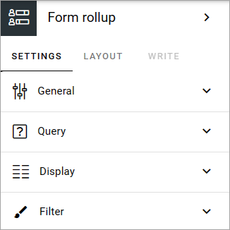
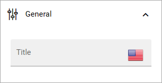
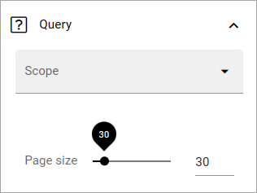
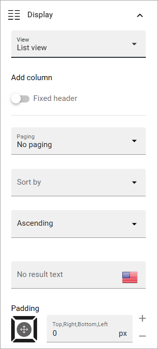
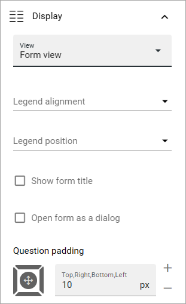

Form rollup
========================

This is a new block in Omnia 7.6. Here's a basic description. More will be added soon.

The following settings are available:

General
----------
Here you can adda title for the block, if needed.

Query
----------
Set the scope and the page size here.

The scope can be the tenant, one or more business profiles or one or more apps.

When you have selected "Tenant" as the scope, you can add some filters and when you have selected "Business profile" or "Apps", you can select one or more specific business profiles or apps.

Display
----------
The following is available here, if select "List view":

If you select "Fixed header", the header will always be shown when users scroll down the list.

Remember, you have to add at least one column for the column view to work.

The rest of the options should be self explanatory.

If you select "Form view", the top part is different:

Additional information about these options will be added soon.

Filter
---------
These are common filter options. See this page for more information: :doc:`Filter options for blocks </blocks/general-block-settings/filter-options-block/index>`

Layout and Write
******************
The Write tab is not used here. The Layout tab contains general settings for blocks. For more information see: :doc:`General block settings </blocks/general-block-settings/index>`

