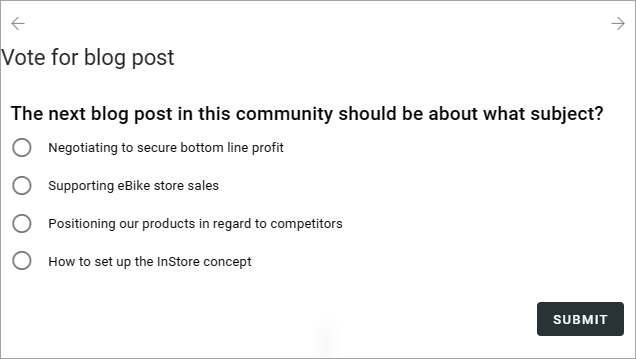
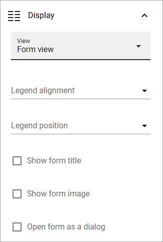
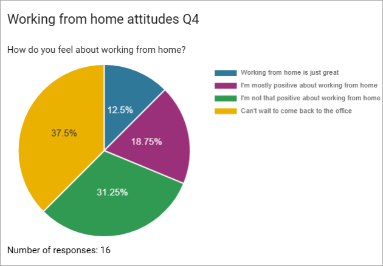
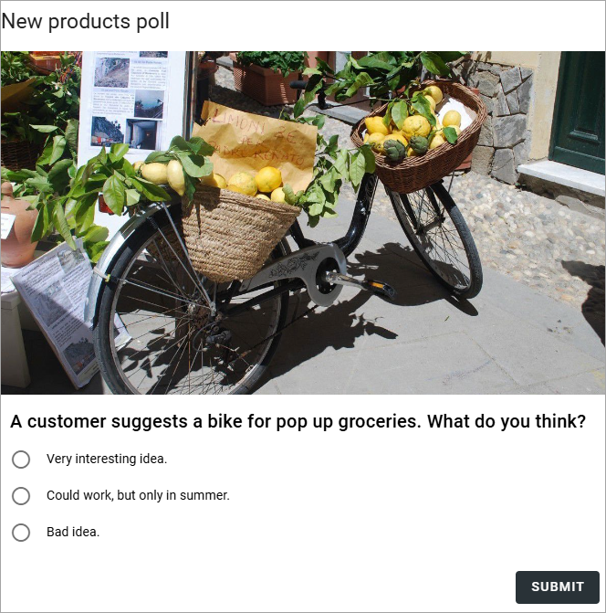

Form rollup
========================

This is a new block in Omnia 7.6, used to rollup forms either for listing forms for various purposes, or for displaying a number of forms to be used.

Settings
*************
The following settings are available:

.. image:: form-rollup-settings.png

General
----------
Here you can add a title for the block, if needed.

.. image:: form-rollup-general.png

Query
----------
Set the scope and the page size here.

.. image:: form-rollup-query.png

The scope can be the tenant, one or more business profiles or one or more apps. 

As the next step you can add filters for what you want to show in the block.

Custom date filtering
------------------------
In Omnia 7.7 and later you may be able to use custom filering.

If the scope is filtered on some kind of time property, custom date filtering can be set.

See this page for more information about custom date filtering: :doc:`Custom date filtering </general-assets/custom-date-filtering/index>` 

Display
----------
You can select List view or Form view. List view is, as the name suggests, meant for listing all the forms that meet the scope settings.  

The following is available here, if you select "List view":

.. image:: form-rollup-display.png

+ **Add column**: One or more columns must be added for the List view to work.
+ **Fixed header**: If you select this option, the header will always be shown when users scroll down the list.

The rest of the options should be self explanatory.

Here's a simple example of a List view:

.. image:: form-rollup-display-list.png

Form view is used to actually display the forms (but also see "Open form as dialog" below). Users can then go trough the different steps of the forms that meet the scope, and on to the next form. 

Here's a simple example of a Form view:

If you select "Form view", the top part of the settings is different:

+ **Legend alignment**: Select the alignment of the description in the diagrams here. Works together with the Legend position.
+ **Legend position**: Select position for the description in the diagrams, in relation to the Legend alignment.
+ **Show form title**: Select this option to show the title of the form.
+ **Show form image**: (Available in Omnia 7.6.2). To show the images from the forms, if any, select this option. 
+ **Open form as dialog**: If you select this option, the actual form is not shown. Instead a button to open the form is displayed. Users can then click the arrows to see which forms are available, and click the button to open a form to have a look at or use.

In this example, legend alignment is "Start" and legend position is "Right":

In this example, "Open form as dialog" is selected:

.. image:: form-as-dialog.png

In this example an image has been added to the form:

Filter
---------
These are common filter options. See this page for more information: :doc:`Filter options for blocks </blocks/general-block-settings/filter-options-block/index>`

Layout and Write
******************
The Write tab is not used here. The Layout tab contains general settings for blocks. For more information see: :doc:`General block settings </blocks/general-block-settings/index>`

