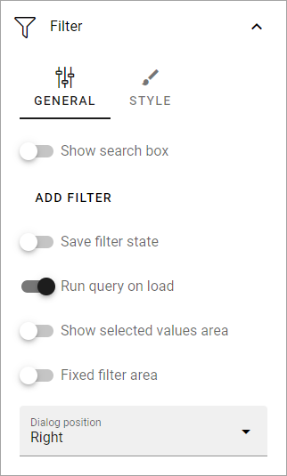
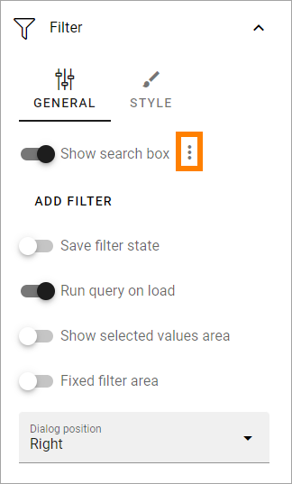
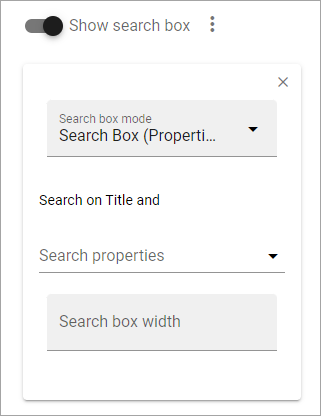

Filter options for blocks in Omnia 7.0
=============================================

This is a description of upcoming option in Omnia 7.0. 

**Work on this documentation has just started.**

In Omnia 7.0 and later, alla Filter and Refiner options for blocks, are now found under Filter (meaning theres no Refiner options any more).

The following Filter options are now available:

+ **Show Search Box**: To add a search box, select this option. You can do that without selecting any other options.
+ **Save filter state**: (A description will be added soon).
+ **Run query on load**: (A description will be added soon).
+ **Show selected values area**: (A description will be added soon).
+ **Fixed filter area**: (A description will be added soon).
+ **Dialog position**: You can choose to place the dialog Left or Right.

+ **Add filter**: To add filters, click this link. See below for more information.
+ **Only search when using filter**: If you select this option the list is empty when the user enters the page. The user must choose a filter for the search to be executed.
+ **Hide filter by default**: If you chose a search box you can select this option. Then no filters are shown until users has executed a search and got a search result.

Settings for search box
***************************
If you added a Search Box a number of options becomes available under a dot menu:

Default value
-------------
You can add a default value for the search field.

Settings
------------
This is available under Settings for the search box:

If search should be possible on anything else than the title, add the property here.

Use "Search box width" to set .. yes, no doubt about what this settings is about.

Add filter
***************
To add filters, do the following:

1. Click Add filter.

.. image:: filters-new-add-new.png

2. Open the list and add a property to filter on.

.. image:: filters-new-add-list-new.png

It can be a quite long list. You can press any key to go that part of the list, for example P to go to properties starting with Page.

Some properties may have additional options, which you normally can choose (not mandatory) for more detailed filter options. Here's an example:

.. image:: filters-new-add-list-2new.png

In this example users can select either Anna or Robert as Approved By.

3. Continue adding filters until you're done.

4. If you added several filters, select Adjust Filters the decide the order.

