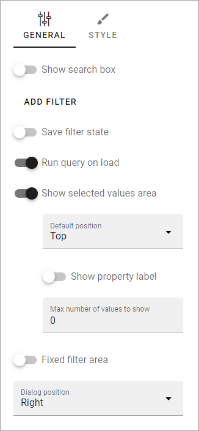
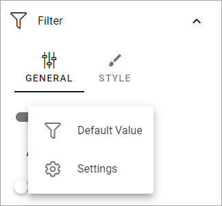
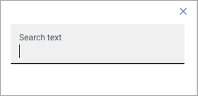
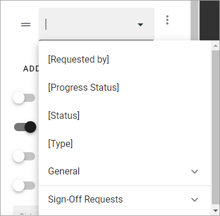
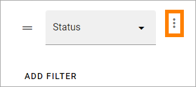
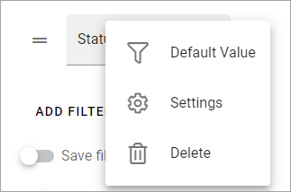
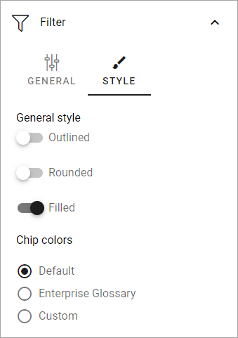

Filter options for blocks in Omnia 7.0
=============================================

**Work on this documentation is ongoing.**

In Omnia 7.0 and later, all filter and refiner options for blocks, are now found under Filter.

Exactly which options will be available here will depend on the type of block and sometimes other options already selected. It will take some time for the documentation to be complete in that respect.

Here's an example of available filter options:

+ **Show Search Box**: To add a search box, select this option. You can do that without selecting any other options.
+ **Add filter**: To add filters, click this link. See below for more information.
+ **Save filter state**:  If you select this option the filter keeps it’s state in the page url as long as the page is active, and will be activated when the user goes back to the page, by using the browser’s Back button. The url can also be copied and for example be used to prepopulate the rollup.
+ **Run query on load**: Decide if the query should be run on load, so the list is filled with when the user enters the page, or not. If there are a lot of requests, an effective solution could be to show a search box and not use this option.
+ **Show selected values area**: Select this option to show the filters chosen.
+ **Default position**: Available when "Show sleceted values area" is selected. Can be Top, Left, Right or Dialog.
+ **Show property label**: Available when "Show sleceted values area" is selected. If selected, the property label is shown as meta data.
+ **Max number of values to show**: (A description will be added soon).
+ **Max number of values to show**: (A description will be added soon).
+ **Fixed filter area**: Select this option to set the filter area as fixed area when scrolling, meaning the filter area will be displayed all the time when you scroll down in a list.
+ **Dialog position**: You can choose to place the dialog Left or Right.

Settings for search box
***************************
If you added a Search Box a number of options becomes available under a dot menu:

.. image:: filter-search-settings-dot.png

Default value
-------------
Here you can add a default value for the search field, which means a prepopulated search result.

Settings
------------
This can be available under Settings for the search box:

.. image:: filter-search-settings-dot-settings.png

+ **search box mode**: Can be a search based on properties or a full text search.
+ **Search on Title and...**: If search should be possible on anything else than the title, add the property here.
+ **Search box width**: Yes, no doubt about what this setting does.

Add filter
***************
To add filters, do the following:

1. Click ADD FILTER.
2. Open the list and add a property to filter on.

It can be a quite long list. You can press any key to go to that part of the list, for example P to go to properties starting with Page.

Some properties may have additional options, which you normally can choose (not mandatory) for more detailed filter options, available under a dot menu. 

Here's an example:

+ **Default Value**: You can add a default value for the search field.
+ **Settings**: Choose "Settings" to show the following three options.
+ **Filter Type**: Can be Dropdoen or List.
+ **Defult position**: Can be top, Left, Right or Dialog.
+ **Fixed filter width**: The filter width is per default dynamic. Set a value here to make the filter width fixed.
+ **Delete**: Click to delete the filter.

Style options
***************
the following options are available for filter style:

+ **General style**: Should be self explanatory.
+ **Chip colors**: (A description will be added soon).

