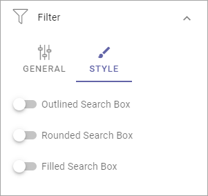

Filter UI
============

Here's a general description on how to add filters for a block in Omnia 6.13 and earlier, when the option is available. Here, all options are describe, even if all is not available everywhere.

For a description of filter options in Omnia 7.0 and later, see: 

The first step is:

.. image:: filter-new-2.png

+ **Position**: Choose where to place the filters; Top, Left or Right.
+ **Add filter**: To add filters, click this link. See below for more information.
+ **Show Search Box**: To add a search box, select this option. You can do that without adding filters.
+ **Only search when using filter**: If you select this option the list is empty when the user enters the page. The user must choose a filter for the search to be executed.
+ **Hide filter by default**: If you chose a search box you can select this option. Then no filters are shown until users has executed a search and got a search result.

Settings for search box
------------------------
If you added a Search Box a number of options becomes available under STYLE:

The options should be fairly self explanatory.

Add filter
---------------
To add filters, do the following:

1. Click Add filter.

.. image:: filters-new-add-new.png

2. Open the list and add a property to filter on.

.. image:: filters-new-add-list-new.png

It can be a quite long list. You can press any key to go that part of the list, for example P to go to properties starting with Page.

Some properties may have additional options, which you normally can choose (not mandatory) for more detailed filter options. Here's an example:

.. image:: filters-new-add-list-2new.png

In this example users can select either Anna or Robert as Approved By.

3. Continue adding filters until you're done.

4. If you added several filters, select Adjust Filters the decide the order.
