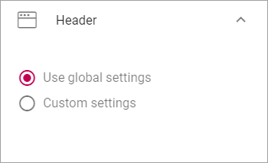
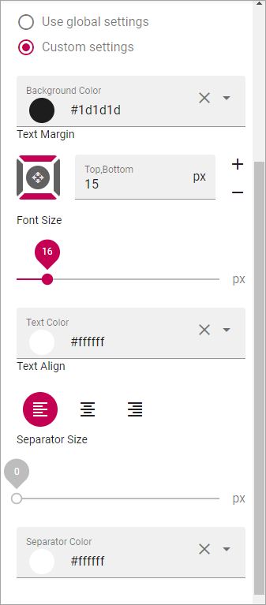
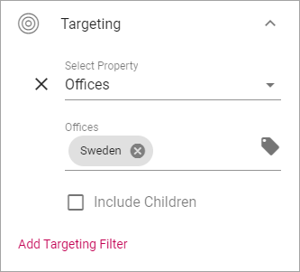
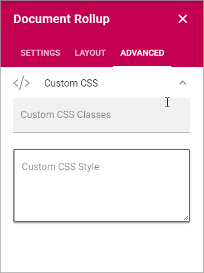

General Block Settings
===========================================

**(This page is beeing edited - a major update. Check back later.)**

The Layout tab and the Advanced tab contains settings that are general for most blocks, but scoped for each block. 

.. image:: general-block.png

Layout
*********
The Layout tab contain the following settings:

.. image:: layout-tab-new.png

Spacing
--------
Use this setting to add some space from the block's border to the content.

.. image:: general-spacing.png

Style
------
Use these settings för blobk style:

.. image:: general-style.png

+ **Chrome**: 
+ **Background color**: 
+ **Elevation**: 

Header
--------
For Header you can choose to use the global settings (set up in Omnia Admin) or use Custom Settings for this block.

For Custom Header Settings you can set the following:

Targeting
-------------
A lot of blocks can be targeted to one or more groups using Targeting Properties. The Targeting Properties must be set up in Omnia Admin, see the section on this page: :doc:`Properties </admin-settings/tenant-settings/properties/index>`

To target a block, open the settings for the block and select "Add Targeting Filter".

.. image:: layout-targeting-new.png

Then select Targeting Property from the list. As the next step you can select to include all Children, or you can target one or more of the Children specifically. Here's an example with the Sweden office selected for the Office property.

You can add as many Targeting Properties for a block as is needed, this way. To remove a target, just click the X.

Advanced
***********
For some blocks you can use Custom CSS settings. You then use this tab.

