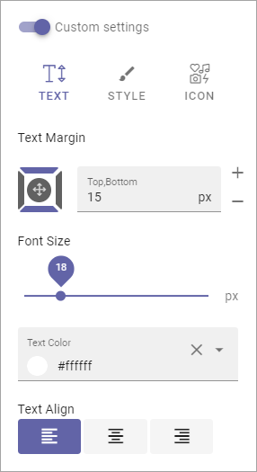
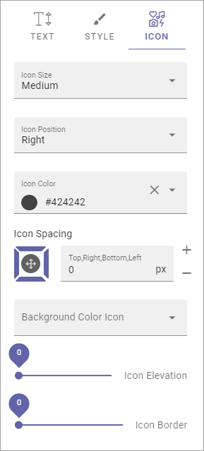

General Block Settings
===========================================

The Layout tab and the Advanced tab contains settings that are general for most blocks, but scoped for each block. 

Adding filters to a block, if it's possible, works the same for most blocks. Find a general description of how to do that here: :doc:`Filter UI </blocks/general-block-settings/filters/index>`

Layout
*********
The Layout tab contain the following settings. You can also set the minimum height for the block, using the slider.

.. image:: layout-tab-new2.png

Spacing
--------
Use this setting to add some space from the block's border in to the content.

.. image:: general-spacing-new.png

Theming
--------
If you would like to set a custom style for this block, click Custom Theme, and these settings becomes available:

.. image:: general-style-new.png

+ **Background, Foreground and Text Color**: Here you can set custom colors for this block.
+ **Show Advanced Settings**: Click here for some additional settings (see below).

To use another theme for the block, click the icon:

.. image:: block-theming.png

The available themes are listed, for example:

.. image:: block-theming-list.png

The themes are set up for the Business Profile in Omnia Admin, see: :doc:`Theme </admin-settings/business-group-settings/settings/theme/index>`

When you have chosen a theme you can edit colors for background, foreground and text, if needed. Note that the theme and colors you chose are shown in the block for a preview.

When you select Show Advanced Settings, the following settings becomes available:

.. image:: block-theming-advanced.png

You can try out these settings for various effects. Changes ar shown in the block so you can see the effect.

Header
--------
For Header you can choose to use the global settings (set up in Omnia Admin) or use Custom Settings for this block. You can also select an icon, if one should be shown (If you don't salect an icon, Icon Type has no effect.)

.. image:: layout-header-new2.png

For Custom Header Settings you can set the following for TEXT:

The following is available for STYLE:

.. image:: layout-header-custom-style.png

+ **Follow Theming**: Select this to follow the theming you selected under Theming. If you don't you can select a custom background color.

The rest of the options should be self explanatory.

And these settings are available for ICON:

It's just to try different settings and see the effect in the block.

Targeting
-------------
A lot of blocks can be targeted to one or more groups using Targeting Properties. The Targeting Properties must be set up in Omnia Admin, see the section on this page: :doc:`Properties </admin-settings/tenant-settings/properties/index>`

To target a block, open the settings for the block and select "Add Targeting Filter".

.. image:: layout-targeting-new2.png

Then select Targeting Property from the list. As the next step you can select to include all Children, or you can target one or more of the Children specifically. Here's an example with the Sweden office selected for the Office property.

.. image:: targeting-sweden-new2.png

You can add as many Targeting Properties for a block as is needed, this way. To remove a target, just click the X.

Advanced
***********
For some blocks you can use Custom CSS settings. You then use this tab.

.. image:: layout-css-new2.png

