General block settings
===========================================

The Layout tab contains settings that are general for most blocks, but scoped for each block. 

Adding filters to a block, if it's possible, works the same for most blocks. Find a general description of how to do that here:

For Omnia 6.13 and earlier :doc:`Filter UI </blocks/general-block-settings/filters/index>`

For Omnia 7.0 and later :doc:`Filter options for blocks in Omnia v7 </blocks/general-block-settings/filter-options-block/index>`

The Layout tab contains the following settings (images from Omnia 7.5):

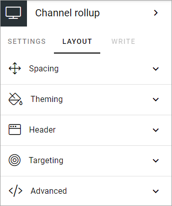

Spacing
*********
Use this setting to add some space from the block's border in to the content and set the minimum height for the block.

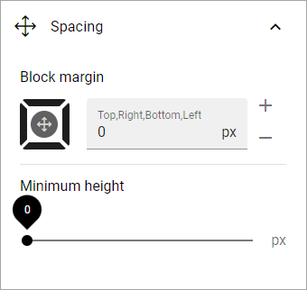

Theming
**********
If you would like to set a custom style for this block, click "Custom theme", and these settings becomes available:

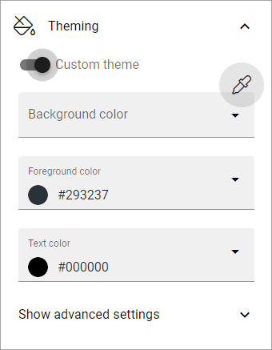

+ **Background, Foreground and Text Color**: Here you can set custom colors for this block.
+ **Show advanced settings**: Click here for some additional settings (see below).

To use another theme for the block, click the icon:

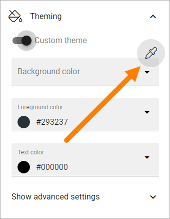

The available themes are listed, for example:

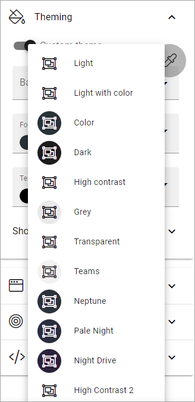

The themes are set up for the business profile in Omnia admin, see: :doc:`Theme </admin-settings/business-group-settings/settings/theme/index>`

When you have chosen a theme you can edit colors for background, foreground and text, if needed. Note that the theme and colors you chose are shown in the block for a preview.

When you select "Show advanced settings", the following settings becomes available:

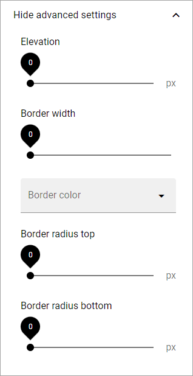

You can try out these settings for various effects. You can see a preview in the block.

Header
*********
The follwowing is available for header settings:

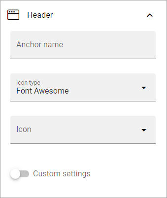

+ **Anchor name**: You can set an anchor name for this block. When a block has an anchor name, you can link to the block, using a the Add Link block or using an action button. In Omnia 7.5 it's also possible to create navigation based om anchors.
+ **Icon type**: If you would like an icon to be shown for the block, the first step is to select icon type. (If you don't select an icon, Icon type has no effect).
+ **Icon**: After having selected icon type, then select the icon.
+ **Custom settings**: For Header you can choose to use the global settings (set up in Omnia admin) or use custom settings for this block.

Available custom settings for TEXT:

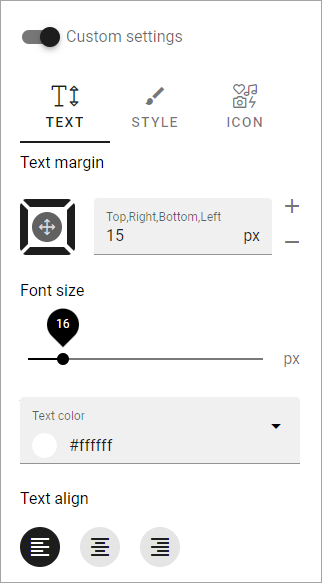

You can set these custom settings, for STYLE:

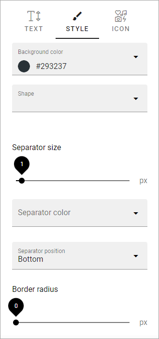

The options should be self explanatory.

These custom settings are available for ICON:

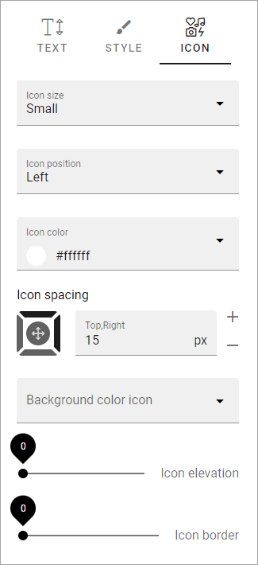

You can just try out different settings and see the effect in the block.

Targeting
************
A lot of blocks can be targeted to one or more users or groups using targeting properties. 

To target a block, open the settings for the block and select "Add targeting filter".

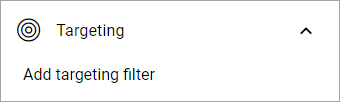

You set up targeting for a block, if available, the same way as in many other parts of Omnia. See this page for more information: :doc:`Using targeting </general-assets/targeting-in-omnia/index>`

Advanced
***********
For some blocks you can use Custom CSS settings:

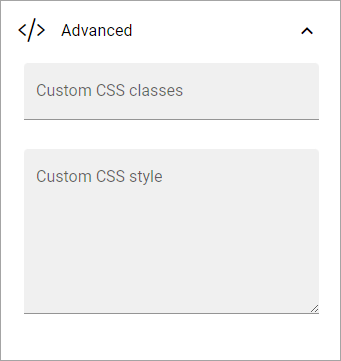

