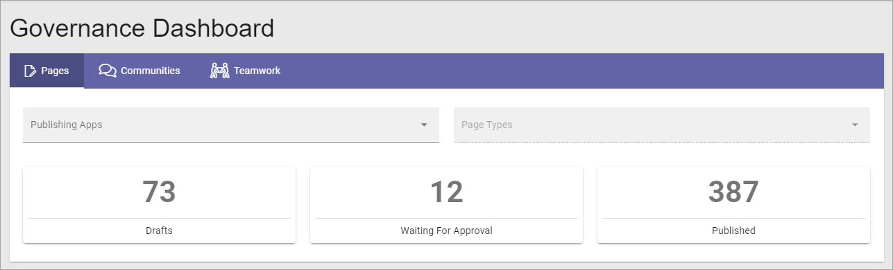
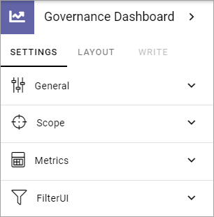
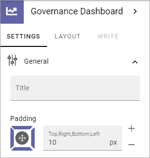
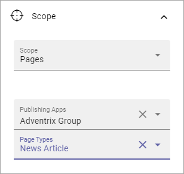
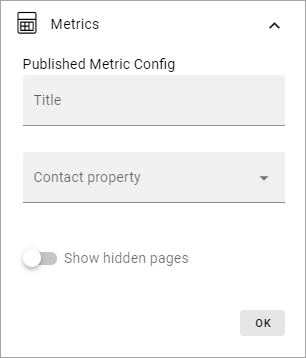
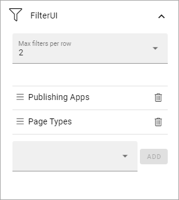

Governance Dashboard
======================

Use this block to create overviews of Key Performance Indicators - for different kinds of pages, teamworks, communities and more. 

Note that this block is not available in Omnia 6.5 and later. The Dashboard functionality has been moved to Omnia Admin, and has been improved. You can find more information here: :doc:`The Dashboard </admin-settings/tenant-settings/dashboard/index>`

Here's an example using three blocks in three sections to create three different dashboards:

Settings
*********
The following settings are available for the block:

(Metrics and Filter UI are shown when you select scope.)

General
--------
You can set the following under General:

+ **Title**: If a title should be shown for the block, add it in this field. If variations exists, only one title can be set, as in the image above. In that case, titles in other languages are set in the variations. If no variation exists for the page, you can set the title in the languages active in the tenant. 
+ **Padding**: You can set some padding between the edge of the block and the content, if needed.

Scope
-------
Here you can set the scope for the block, Pages or Teamwork.

.. image:: dashboard-settings-scope-new2.png

When you have selected Pages, you CAN choose one Publishing App to get the results from, and when you have done that, you can drill done even further by selecting just pages with a certain Page Type within that Publishing App. If you don't select a publishing app you get results from the whole tenant.

Here's an example to display results for just news articles within a publishing app:

When you have selected Teamwork as the scope, you CAN then choose to display results from just teamworks created from one certain template. If you don't choose a template here you get results from all teamworks in the tenant.

.. image:: dashboard-settings-scope-teamwork-new.png

Metrics
---------
Under Metrics you set further settings for the chosen scope. You must select metrics or nothing will be shown.

.. image:: dashboard-settings-metrics-new2.png

1. Use Metrics per row to set how the different results should be displayed within the given space.
2. Select which metrics to display.

When you select Publishes metrics for pages you can edit the title for the metric and you can select the contact property. You can also choose the show hidden pages.

The chosen metrics are shown as a list, for example:

.. image:: dashboard-settings-metrics-new-pages4.png

You can set the order by using drag and drop. Click the pen to edit the settings. Click the dust bin to delete the metric.

For Teamworks you can select Active Teamworks or New Teamworks. For New Teamworks you can set the time range: One Week, Two Weeks, One Month or Custom. For Custom you can set the number of days.

.. image:: dashboard-settings-metrics-new-teamwork-new.png

Here's an example for Pages to keep track of the number of published pages, the number of draft pages and the number of pages waiting for approval, first with 3 Metrics per row:

.. image:: dashboard-settings-metrics-row3-new.png

and with 1 Metric per row:

.. image:: dashboard-settings-metrics-row1-new.png

Here's a simple example for teamworks, showing the total number of teamworks in the tenant and the number of new teamworks this month (1 metric per row):

.. image:: dashboard-settings-metrics-teamwork-example-new.png

Filter UI
------------
Here you can add filters available for users or add a search box (image with two example filters):

How to add filters works the same for most blocks. See this page for more information: :doc:`Filter UI </blocks/general-block-settings/filters/index>`

Layout and Write
*********************
The WRITE Tab is not used here. The LAYOUT tab contains general settings, see: :doc:`General Block Settings </blocks/general-block-settings/index>`

