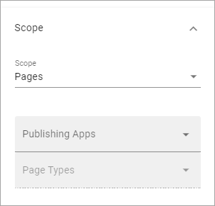
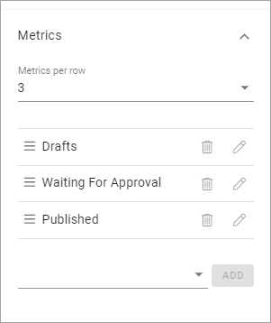

Governance Dashboard
======================

Use this block to create overviews of Key Performance Indicators - for different kinds of pages, teamworks, communities and more.

Here's an example using three blocks in three sections to create three different dashboards:

.. image:: dashboard-example.png

Settings
*********
The following settings are available for the block:

image:: dashboard-settings.png

The tabs Layout and Advanced contain general settings, see: :doc:`General Block Settings </blocks/general-block-settings/index>`

General
--------
You can set the following under General:

.. image:: dashboard-settings-general.png

(More information will be added soon.)

Scope
-------
Here you can set:

(More information will be added soon.)

Metrics
---------
the following can be set for Metrics (image with three examples):

(More information will be added soon.)

Filter UI
------------
Here you can add filters available for users (image with two example filters):

.. image:: dashboard-settings-filter.png

(More information will be added soon.)

